<div align="center">


# 番剧中枢 · Bangumi Nexus

**一个插件，管完你的整条番剧链路：查番 → 追番 → 订阅 → 播报。**

[](https://github.com/AstrBotDevs/AstrBot)
[](https://www.python.org/)
[](LICENSE)
[](#指令一览)
[](#卡片主题预览)

</div>

---

## 这是什么

番剧中枢是 [AstrBot](https://github.com/AstrBotDevs/AstrBot) 的番剧插件。它把散落在 8 个数据源里的信息拼成一张卡片，
把「今天播什么」推到群里，把 RSS 更新变成一条有人味的消息，还给你一个能在浏览器里点点点的管理面板。

它想解决的是这么一件事：**追番这件事本来需要好几个插件、好几个网站、好几个标签页。**

| 你想做的事 | 以前 | 现在 |
| --- | --- | --- |
| 查一部番的评分、制作组、声优、什么时候播、哪里能看 | 开 Bangumi + 开季度新番表 + 开在线站 | `/查番 芙莉莲`，一张卡全给 |
| 记住自己追到第几集 | 记在备忘录里 | `/追番` + `/看到 芙莉莲 5` |
| 新一集出了立刻知道 | 手动刷 Mikan | `/sub`，字幕组一发布就推群 |
| 每天早上看今天有什么番 | 手动查 | 定时播报，还能让 Bot 用自己的人格说 |
| 本地下载器已经订好的番，再在群里录一遍 | 一部部手打 `/追番` | 开 ani-rss 同步，一键搬进来 |
| 改配置 | 翻 JSON | 打开 Dashboard 里的管理页 |

### 亮点

- **跨源聚合，不是简单堆链接。** 以 [bangumi-data](https://github.com/bangumi-data/bangumi-data) 的跨站 ID 表为枢纽，
  把 Bangumi 条目、長門番堂的制作组／声优、anime1 的在线索引、AGE 动漫的更新集数、萌娘百科词条、Mikan 的 RSS 地址
  匹配到同一部番上。标题做了半角化、罗马音、季数别名的归一化，中日繁三种写法都能对上。
- **6 套卡片主题，4 级渲染兜底。** 优先用 AstrBot 自带的无头浏览器渲染 HTML 模板；渲染失败自动降级到本地 Pillow 绘制，
  再不行走 t2i 文字转图，最后退回纯文本。**任何一环挂掉，功能都不会消失。**
- **通知走 AstrBot 人格。** 新番播报 / RSS 更新 / Webhook 事件会先让当前人格用自己的口吻说一句，再带着卡片一起发。
  插件只负责给「要转述什么」，语气和人设完全由你在 AstrBot 里配的人格决定。
- **一个像样的管理面板。** 10 个视图、6 套主题、明暗自适应、紧凑模式。改配置、看日志、管追番、调订阅、
  预览卡片、跑健康检查，都不用碰命令行。
- **订阅先选组，不刷屏。** `/sub 番名` 会先列出 Mikan 上的字幕组，回序号才订阅，订上的是单组 RSS ——
  一集只推一条，而不是把所有组、所有语言、所有画质一起收下。再叠一层排除词表（全局 + 按会话，16 组预设可勾）
  和**同集归并** —— 同一集的简繁 / 画质 / Baha 与 ABEMA 多个版本只推一条，跨天才到的其它版本也会在时间窗内跳过。
- **每会话独立设置。** 卡片主题、渲染方式、结果版式、是否收播报、推送投递到哪个会话，都能按群 / 按私聊分别设定，
  互不干扰。
- **追番表会自己往前走。** 字幕组一发布第 N 集，追番进度就自动推到第 N 集（`rss_auto_progress`，默认开）；
  下载器 Webhook 入库、ani-rss 同步也走同一条回填逻辑。只往前推、不超总集数，`/看到` 手动改的值不会被冲掉。
- **可以只关心自己追的番。** 打开 `push_only_watchlist`，每日播报就只列追番表里有的番；
  再配上 ani-rss 同步，本地下载器订了什么，群里就播什么。
- **42 条指令，24 个中文别名。** `/动漫`、`/放送时间`、`/追番列表`、`/抽番` 都能直接喊，不用背英文。

<p align="center">
  <a href="#管理面板">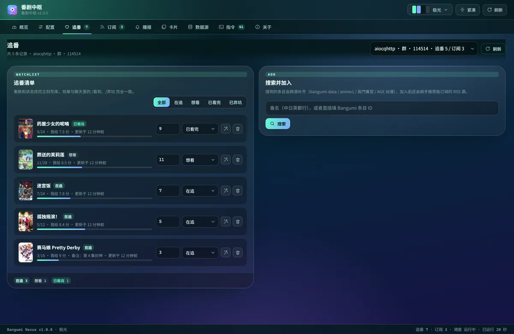</a><br>
  <sub>Dashboard 里的管理面板（更多截图见 <a href="#管理面板">管理面板</a>）</sub>
</p>

---

## 卡片主题预览

六套配色，聊天里发 `/番剧中枢 樱绯` 就能临时换一套看看，满意了再在配置里定下来。

| 午夜霓虹 `midnight` | 极光 `aurora` |
| --- | --- |
| 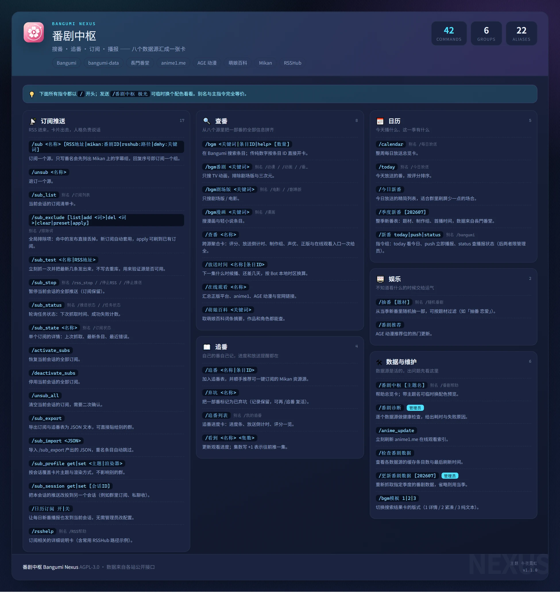 | 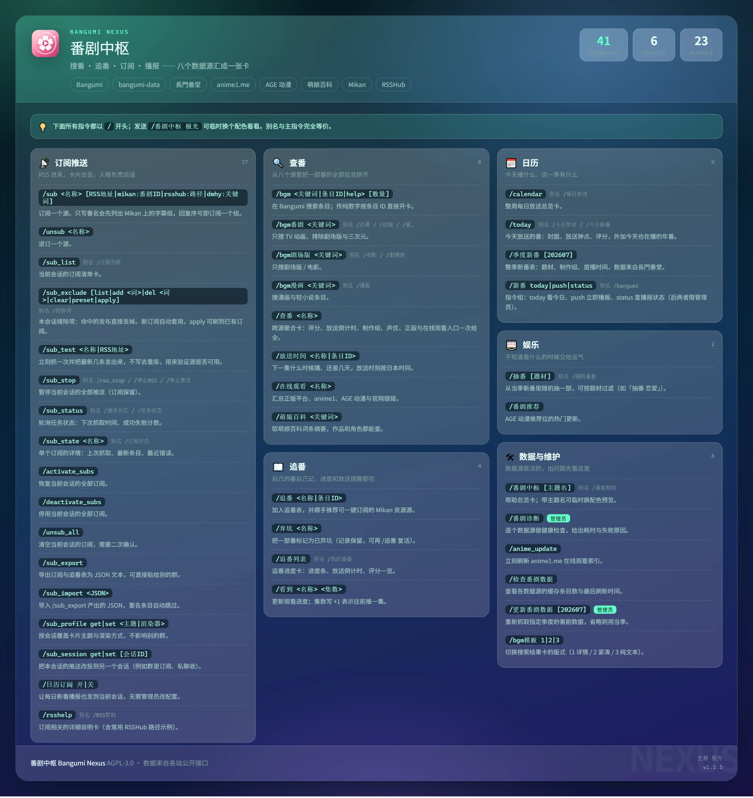 |

| 樱绯 `sakura` | 蓝图 `blueprint` |
| --- | --- |
| 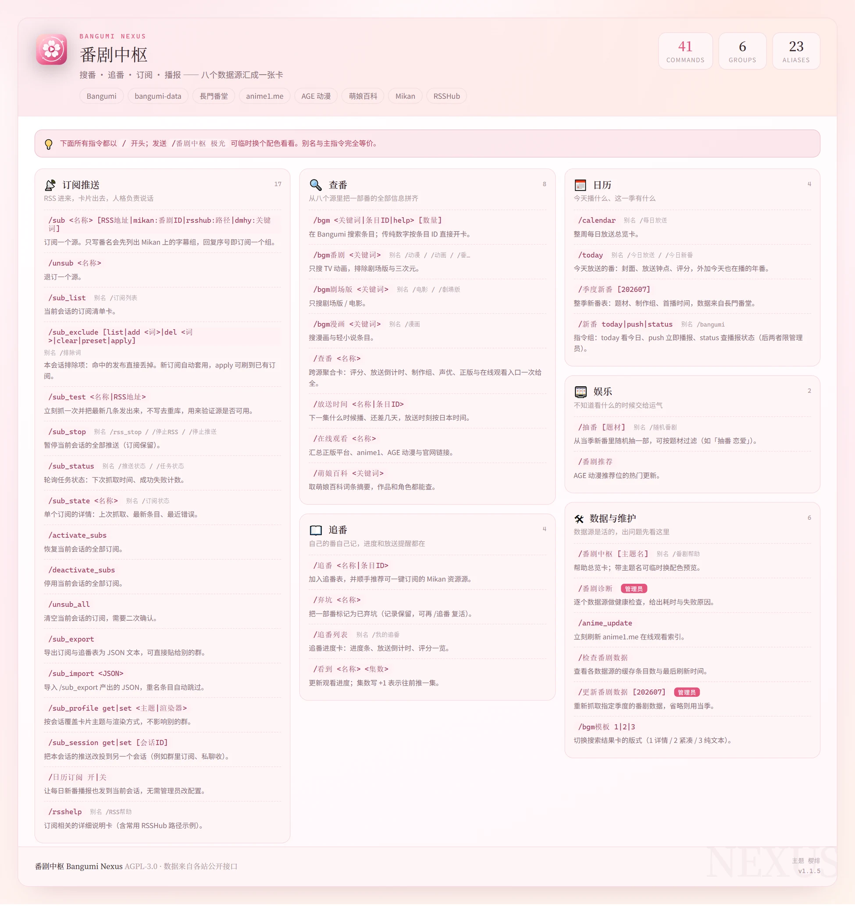 | 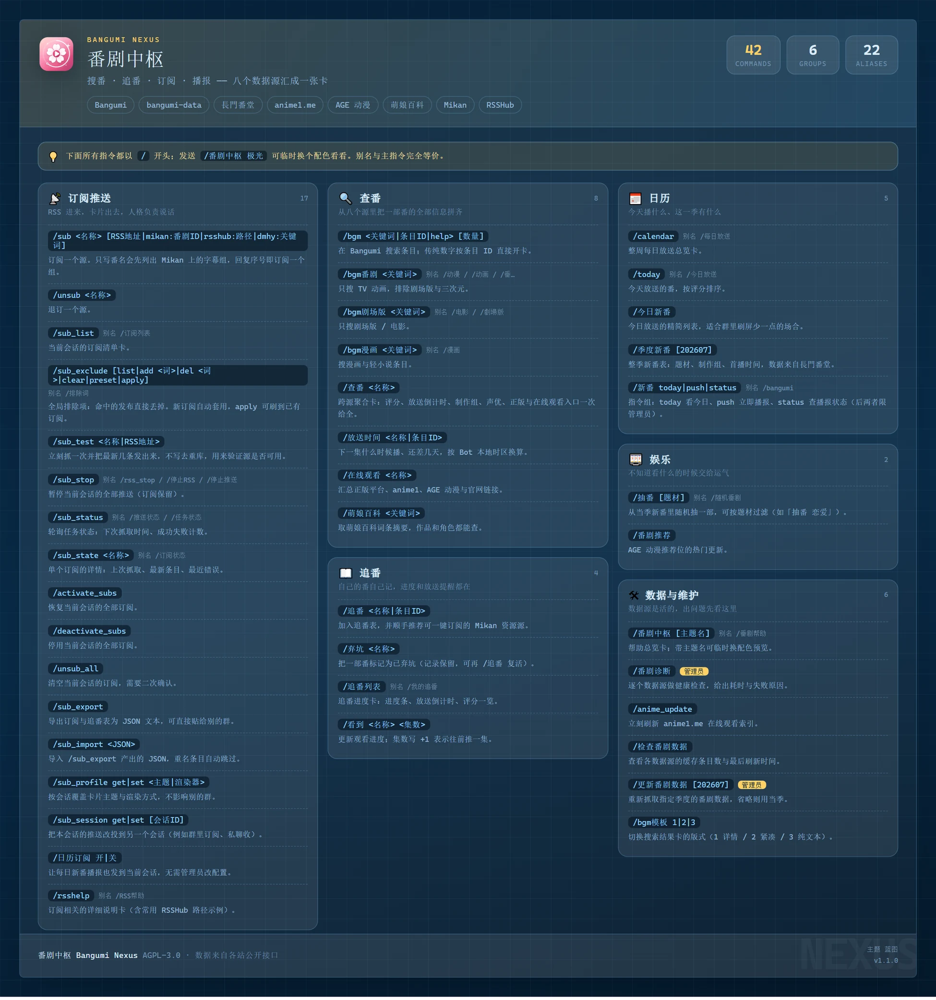 |

| 素笺 `paper` | 落日 `sunset` |
| --- | --- |
| 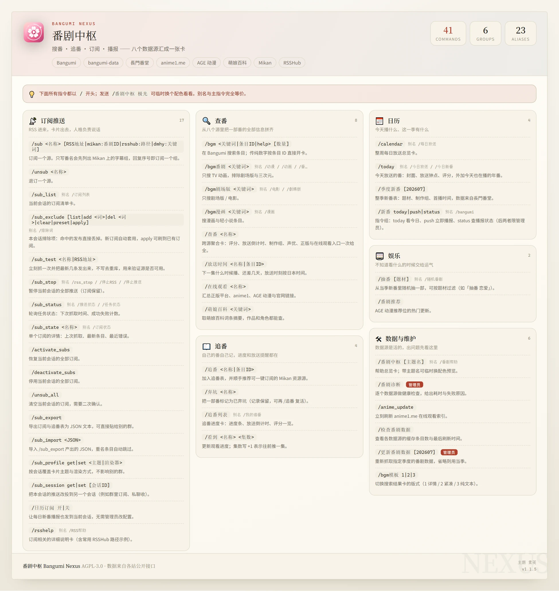 | 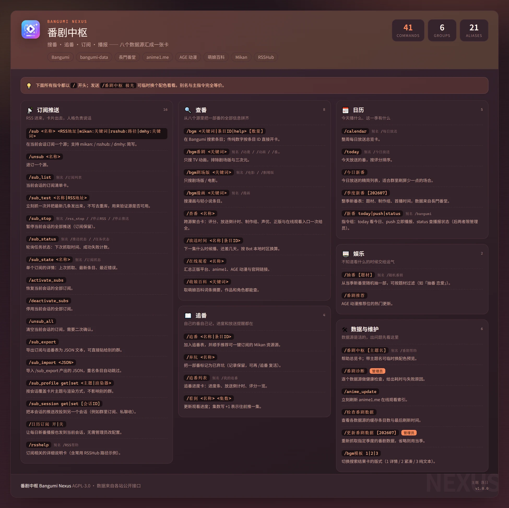 |

> 上面这六张就是 `/番剧中枢` 的帮助卡实拍，其余卡片（日历、条目、追番、更新通知、抽番、季度表、诊断）
> 共用同一套设计语言与配色变量。

---

## 安装

### 方式一：插件市场（推荐）

AstrBot Dashboard → **插件市场** → 搜索 `番剧中枢` 或 `bangumi_nexus` → 安装。

### 方式二：手动安装

```bash
cd AstrBot/data/plugins
git clone https://github.com/Whereis-Alice/astrbot_plugin_bangumi_nexus.git
```

然后在 Dashboard 的插件列表里点「重载插件」。

### 依赖

AstrBot 会自动读取 `requirements.txt` 安装：

| 依赖 | 用途 | 缺了会怎样 |
| --- | --- | --- |
| `httpx[socks]` | 所有网络请求、SOCKS 代理支持 | **必需** |
| `beautifulsoup4` | 解析長門番堂 / AGE / 萌娘百科的网页 | 这三个源不可用，其余正常 |
| `feedparser` | RSS 解析（容错最好） | 自动退回 Python 内置 `xml.etree`，绝大多数源仍可解析 |
| `Pillow` | 卡片渲染的本地兜底 | 少一级降级，仍可用 t2i 与纯文本 |

卡片的 HTML 渲染用的是 AstrBot 自带的渲染能力，**不需要你额外装浏览器**。

---

## 快速上手

装完什么都不用配就能用：

```
/番剧中枢              查看全部指令（帮助卡）
/查番 葬送的芙莉莲      跨源聚合卡，看看效果
/today                 今天播什么
```

想让它真正开始「帮你干活」，配三件事就够：

**1. 追番 + 订阅（在群里发，不用管理员）**

```
/追番 葬送的芙莉莲
```

加进追番表后，插件会顺手列出这部番在 Mikan 上的字幕组，**直接回一个序号**就订上了：

```
1
```

也可以随时自己发起：

```
/sub 葬送的芙莉莲       列出字幕组 → 回序号订阅
```

之后这个字幕组一发布新集，群里就会收到通知（一集一条，不会每个组都推一遍）。

**2. 每日播报（Dashboard 里开）**

插件配置 → **每日播报** → 打开 `push_enabled`，设好 `push_time`。
推送目标有两种填法：在 `push_targets` 里填会话 ID，或者干脆在群里发一句：

```
/日历订阅 开
```

**3. 让通知有人味（默认已开）**

`persona_reply_enabled` 默认开启。只要你的 AstrBot 配了人格和 LLM 供应商，
通知就会变成「人格说一句 + 卡片」，而不是干巴巴的机器人播报。

---

## 指令一览

全部 42 条指令，6 个分类。下表里的 `/` 是默认唤醒前缀，实际请按你的 AstrBot 配置替换。
标注 **（仅管理员）** 的指令需要管理员权限。
#### 🔍 查番 — 从八个源里把一部番的全部信息拼齐

| 指令 | 说明 | 别名 |
| --- | --- | --- |
| `/bgm <关键词|条目ID|help> [数量]` | 在 Bangumi 搜索条目；传纯数字按条目 ID 直接开卡。 | — |
| `/bgm番剧 <关键词>` | 只搜 TV 动画，排除剧场版与三次元。 | `/动漫`、`/动画`、`/番`、`/动画片` |
| `/bgm剧场版 <关键词>` | 只搜剧场版 / 电影。 | `/电影`、`/劇場版` |
| `/bgm漫画 <关键词>` | 搜漫画与轻小说条目。 | `/漫画` |
| `/查番 <名称>` | 跨源聚合卡：评分、放送倒计时、制作组、声优、正版与在线观看入口一次给全。 | — |
| `/放送时间 <名称|条目ID>` | 下一集什么时候播、还差几天，放送时刻按日本时间。 | — |
| `/在线观看 <名称>` | 汇总正版平台、anime1、AGE 动漫与官网链接。 | — |
| `/萌娘百科 <关键词>` | 取萌娘百科词条摘要，作品和角色都能查。 | — |

#### 📅 日历 — 今天播什么、这一季有什么

| 指令 | 说明 | 别名 |
| --- | --- | --- |
| `/calendar` | 整周每日放送总览卡。 | `/每日放送` |
| `/today` | 今天放送的番：封面、放送钟点、评分，外加今天也在播的年番。 | `/今日放送`、`/今日新番` |
| `/季度新番 [202607]` | 整季新番表：题材、制作组、首播时间，数据来自長門番堂。 | — |
| `/新番 today|push|status` | 指令组：today 看今日、push 立即播报、status 查播报状态（后两者限管理员）。 | `/bangumi` |

#### 📖 追番 — 自己的番自己记，进度和放送提醒都在

| 指令 | 说明 | 别名 |
| --- | --- | --- |
| `/追番 <名称|条目ID>` | 加入追番表，并顺手推荐可一键订阅的 Mikan 资源源。 | — |
| `/弃坑 <名称>` | 把一部番标记为已弃坑（记录保留，可再 /追番 复活）。 | — |
| `/追番列表` | 追番进度卡：进度条、放送倒计时、评分一览。 | `/我的追番` |
| `/看到 <名称> <集数>` | 更新观看进度；集数写 +1 表示往前推一集。 | — |

#### 📡 订阅推送 — RSS 进来，卡片出去，人格负责说话

| 指令 | 说明 | 别名 |
| --- | --- | --- |
| `/sub <名称> [RSS地址|mikan:番剧ID|rsshub:路径|dmhy:关键词]` | 在当前会话订阅一个源。**只写番名会先列出 Mikan 上的字幕组，回复序号才订阅**；也支持 mikan: / rsshub: / dmhy: 简写。 | — |
| `/unsub <名称>` | 退订一个源。 | — |
| `/sub_list` | 当前会话的订阅清单卡。 | `/订阅列表` |
| `/sub_exclude [list|add <词>|del <词>|clear|preset|apply]` | 本会话排除项：标题命中的发布直接丢掉。新订阅自动套用，`apply` 可刷到已有订阅。全局层见配置项 `global_excludes`。 | `/排除词` |
| `/sub_test <名称|RSS地址>` | 立刻抓一次并把最新几条发出来，不写去重库，用来验证源是否可用。 | — |
| `/sub_stop` | 暂停当前会话的全部推送（订阅保留）。 | `/rss_stop`、`/停止RSS`、`/停止推送` |
| `/sub_status` | 轮询任务状态：下次抓取时间、成功失败计数。 | `/推送状态`、`/任务状态` |
| `/sub_state <名称>` | 单个订阅的详情：上次抓取、最新条目、最近错误。 | `/订阅状态` |
| `/activate_subs` | 恢复当前会话的全部订阅。 | — |
| `/deactivate_subs` | 停用当前会话的全部订阅。 | — |
| `/unsub_all` | 清空当前会话的订阅，需要二次确认。 | — |
| `/sub_export` | 导出订阅与追番表为 JSON 文本，可直接贴给别的群。 | — |
| `/sub_import <JSON>` | 导入 /sub_export 产出的 JSON，重名条目自动跳过。 | — |
| `/sub_profile get|set <主题|渲染器>` | 按会话覆盖卡片主题与渲染方式，不影响别的群。 | — |
| `/sub_session get|set [会话ID]` | 把本会话的推送改投到另一个会话（例如群里订阅、私聊收）。 | — |
| `/日历订阅 开|关` | 让每日新番播报也发到当前会话，无需管理员改配置。 | — |
| `/rsshelp` | 订阅相关的详细说明卡（含常用 RSSHub 路径示例）。 | `/RSS帮助` |
| `/anirss [sync\|test]` | 看本地 ani-rss 的同步状态；`sync` 立刻同步一次、`test` 只测连接（后两者限管理员）。 | `/同步追番` |

#### 🎰 娱乐 — 不知道看什么的时候交给运气

| 指令 | 说明 | 别名 |
| --- | --- | --- |
| `/抽番 [题材]` | 从当季新番里随机抽一部，可按题材过滤（如「抽番 恋爱」）。 | `/随机番剧` |
| `/番剧推荐` | AGE 动漫推荐位的热门更新。 | — |

#### 🛠 数据与维护 — 数据源是活的，出问题先看这里

| 指令 | 说明 | 别名 |
| --- | --- | --- |
| `/番剧中枢 [主题名]` | 帮助总览卡；带主题名可临时换配色预览。 | `/番剧帮助` |
| `/番剧诊断` | **（仅管理员）** 逐个数据源做健康检查，给出耗时与失败原因。 | — |
| `/anime_update` | 立刻刷新 anime1.me 在线观看索引。 | — |
| `/检查番剧数据` | 查看各数据源的缓存条目数与最后刷新时间。 | — |
| `/更新番剧数据 [202607]` | **（仅管理员）** 重新抓取指定季度的番剧数据，省略则用当季。 | — |
| `/bgm模板 1|2|3` | 切换搜索结果卡的版式（1 详情 / 2 紧凑 / 3 纯文本）。 | — |


### 给 LLM 用的工具

插件还注册了 4 个函数工具，你的 Bot 在自由对话里也能自己调用它们，不需要用户记指令：

| 工具 | 作用 |
| --- | --- |
| `get_anime_list` | 按季度／时间范围列出番剧表 |
| `get_watch_url` | 拿到某部番的在线观看地址 |
| `search_moegirl` | 查萌娘百科词条摘要 |
| `search_bangumi_subject` | 在 Bangumi 搜条目并返回结构化信息 |

于是「有什么新番推荐吗」这种自然语言提问，Bot 可以自己去查了再回答。

---

## 配置项

共 71 项，全部可以在 Dashboard 的插件配置页或本插件自带的管理页里改。**开箱默认值就能用，下面这些都是可选的调整。**

<details>
<summary>管理页里的配置视图长这样（点开看全图）</summary>

<p align="center">
  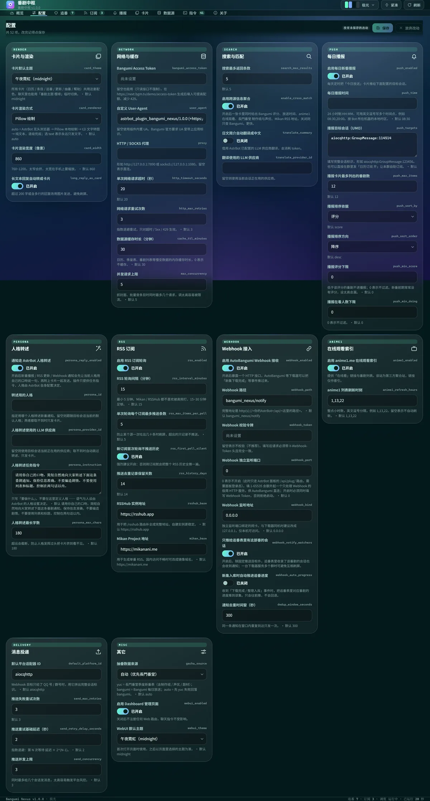
</p>

</details>

#### 卡片与渲染

| 配置项 | 类型 | 默认值 | 说明 |
| --- | --- | --- | --- |
| `card_theme` | string | `midnight` | 卡片默认主题。所有卡片（日历 / 条目 / 追番 / 更新 / 抽番 / 帮助）共用这套配色，聊天里也能用「番剧主题 樱绯」临时切换。<br>可选：`midnight`、`aurora`、`sakura`、`blueprint`、`paper`、`sunset` |
| `card_renderer` | string | `auto` | 卡片渲染方式。auto = AstrBot 无头浏览器 → Pillow 本地绘制 → t2i 文字转图 → 纯文本，逐级兜底；选 text 表示永远只发文字。<br>可选：`auto`、`html`、`raster`、`t2i`、`text` |
| `card_width` | int | `860` | 卡片渲染宽度（像素）。760~1200。太窄会挤，太宽在手机上要缩放。 |
| `show_watch_text` | bool | 开 | 卡片附带可点击的在线观看链接。卡片是图片，图里的链接点不动；开启后会在卡片下面再发一小段纯文本链接，方便直接点开。关掉则只发图。 |

#### 网络与缓存

| 配置项 | 类型 | 默认值 | 说明 |
| --- | --- | --- | --- |
| `bangumi_access_token` | string | （空） | Bangumi Access Token。留空也能用（只读接口不强制）。在 https://next.bgm.tv/demo/access-token 生成后填入可提高配额、减少 429。 |
| `user_agent` | string | （空） | 自定义 User-Agent。留空使用插件内置 UA。Bangumi 官方要求 UA 里带上应用标识。 |
| `proxy` | string | （空） | HTTP / SOCKS 代理。形如 http://127.0.0.1:7890 或 socks5://127.0.0.1:1080。留空表示直连。 |
| `http_timeout_seconds` | int | `20` | 单次网络请求超时（秒） |
| `http_max_retries` | int | `3` | 网络请求重试次数。指数退避重试，只对超时 / 5xx / 429 生效。 |
| `cache_ttl_minutes` | int | `30` | 数据源缓存时长（分钟）。日历、季度表、番剧列表等慢变数据的内存缓存时长，0 表示不缓存。 |
| `max_concurrency` | int | `5` | 并发请求上限。抓封面、批量查条目时同时最多几个请求，调太高容易被限流。 |

#### 搜索与匹配

| 配置项 | 类型 | 默认值 | 说明 |
| --- | --- | --- | --- |
| `search_max_results` | int | `5` | 搜索最多返回条数 |
| `enable_cross_match` | bool | 开 | 启用跨源信息聚合。开启后一张卡里同时给出 Bangumi 评分、放送时间、anime1 在线观看、長門番堂 制作组与声优、Mikan RSS 地址。关闭则只查 Bangumi，更快。 |
| `translate_summary` | bool | 关 | 日文简介自动翻译成中文。借用 AstrBot 已配置的 LLM 供应商翻译，会消耗 token。 |
| `translate_provider_id` | string | （空） | 翻译使用的 LLM 供应商。留空则使用当前会话正在用的供应商。 |
| `long_reply_as_card` | bool | 开 | 长文本回复自动转成卡片。超过 200 字或含多行的回复改用图片发送，避免刷屏。 |

#### 每日播报

| 配置项 | 类型 | 默认值 | 说明 |
| --- | --- | --- | --- |
| `push_enabled` | bool | 关 | 启用每日新番播报。每天定时把「今日放送」卡片推给下面配置的目标会话。 |
| `push_time` | string | `08:30` | 每日播报时间。24 小时制 HH:MM，可用英文逗号写多个时间点，例如 08:30,20:00。按 Bot 所在机器的本地时区。 |
| `push_targets` | list | （空） | 播报目标会话（UMO）。填写完整会话标识，形如 aiocqhttp:GroupMessage:123456。也可以直接在群里发「日历订阅 开」让本群自助订阅。 |
| `push_max_items` | int | `12` | 播报卡片最多列出的番剧数 |
| `push_sort_by` | string | `score` | 播报排序依据<br>可选：`score`、`doing`、`time`、`name` |
| `push_sort_order` | string | `desc` | 播报排序方向<br>可选：`desc`、`asc` |
| `push_min_score` | float | `0` | 播报评分下限。低于该评分的番剧不进播报；0 表示不过滤。新番前期常常没有评分，设太高会漏。 |
| `push_min_doing` | int | `0` | 播报在看人数下限。0 表示不过滤。 |
| `push_only_watchlist` | bool | 关 | **只播我追的番**。开启后每日播报只保留出现在本会话追番表里的番，其余一律不列；追番表为空时跳过播报而不是发一张空卡。关闭则播当天全部新番。 |

#### 人格转述

| 配置项 | 类型 | 默认值 | 说明 |
| --- | --- | --- | --- |
| `persona_reply_enabled` | bool | 开 | 通知走 AstrBot 人格转述。开启后新番播报 / RSS 更新 / Webhook 通知会先让当前人格用自己的口吻说一句，再附上卡片一起发送。插件只提供任务指令，人格由 AstrBot 自身配置决定。 |
| `persona_id` | string | （空） | 转述用的人格。指定用哪个人格转述新番通知。留空则跟随目标会话当前的默认人格；两者都取不到时只发卡片。 |
| `persona_provider_id` | string | （空） | 人格转述使用的 LLM 供应商。留空则使用目标会话当前正在用的供应商；取不到时自动跳过转述、只发卡片。 |
| `persona_instruction` | text | `请用你自己的口吻，简短自然地向大家转述下面这条番剧通知。保持信息准确，不要编造剧情，不要使用列表和标题，控制在两句话以内。` | 人格转述任务指令。只写「要做什么」，不要在这里定义人格 —— 语气与人设由 AstrBot 的人格设置决定。 |
| `persona_max_chars` | int | `180` | 人格转述最长字数。超出会截断，防止人格发挥过头把卡片挤到看不见。 |

#### RSS 订阅

| 配置项 | 类型 | 默认值 | 说明 |
| --- | --- | --- | --- |
| `rss_enabled` | bool | 开 | 启用 RSS 订阅轮询 |
| `rss_interval_minutes` | int | `15` | RSS 轮询间隔（分钟）。最小 5 分钟。Mikan / RSSHub 都不喜欢被高频打，15~30 分钟足够。 |
| `rss_max_items_per_poll` | int | `5` | 单次轮询每个订阅最多推送条数。防止某个源一次吐出几十条时刷屏，超出的只记录不推送。 |
| `rss_pick_source` | bool | 开 | 只给番名时先让用户挑字幕组。开启后 `/sub 番名` 会先列出 Mikan 上收录该番的字幕组，回复序号才真正订阅；关闭则沿用关键词搜索源，会收下所有组的发布。 |
| `rss_first_poll_silent` | bool | 开 | 新订阅首次轮询不推送历史。强烈建议开启：否则刚订阅就会把整个 RSS 历史全推一遍。 |
| `rss_history_days` | int | `14` | 推送去重记录保留天数 |
| `global_excludes` | list | 空 | **全局排除项**：所有会话无条件生效，写在这里就不用每个群再设一遍。可填预设名（`合集` / `生肉` / `720p`…）或任意关键词。**该填片源还是交给同集归并，取决于你订的是单组单番还是宽 feed**，[分情况说明见这里](#全局层到底该填什么)。 |
| `rss_episode_dedup` | bool | 开 | **同一集只推一个版本**。同一集的简繁 / 画质 / 片源多个版本归并成一条，其余静默跳过；`01v2` 这类修订版优先于原版。 |
| `rss_episode_prefer` | list | `简体, 1080p, Baha, MKV, 外挂` | 同集归并的优先顺序，越靠前权重越高。 |
| `rss_episode_dedup_window_hours` | int | `48` | **同集归并的跨轮次时间窗**（小时）。同一集的不同片源常跨天发布，光在单次轮询内归并会导致「今天推 CR、明天再推 Baha」。开着这个窗口，某一集推过之后窗口内再到的其它版本会静默跳过。`0` = 只在单次轮询内归并。 |
| `rss_auto_progress` | bool | 开 | **RSS 推送时自动回填追番进度**。字幕组发布第 N 集并推送成功后，把追番表里对应那部的进度推到第 N 集。只往前推、不超过总集数、一部番只认标题最接近的那条记录；已弃坑的不动。 |
| `rsshub_base` | string | `https://rsshub.app` | RSSHub 实例地址。用于把 /rsshub 路由补全成完整地址。自建实例更稳定。 |
| `mikan_base` | string | `https://mikanani.me` | Mikan Project 地址。用于生成单番 RSS。国内访问不畅时可改成镜像域名。 |

#### Webhook 接入

| 配置项 | 类型 | 默认值 | 说明 |
| --- | --- | --- | --- |
| `webhook_enabled` | bool | 关 | 启用 AutoBangumi Webhook 接收。开启后暴露一个 HTTP 接口，AutoBangumi 等下载器可以把「新集下载完成」等事件推过来。 |
| `webhook_path` | string | `bangumi_nexus/notify` | Webhook 路径。完整地址是 http(s)://<你的AstrBot>/api/<这里的路径>。 |
| `webhook_token` | string | （空） | Webhook 校验令牌。留空表示不校验（不推荐）。填写后请求必须带 X-Webhook-Token 头且完全一致。 |
| `webhook_notify_watchers` | bool | 开 | 只推给追番表里有这部番的会话。开启后，除固定推送目标外，追番表里收录了该番剧的会话也会收到通知；一台下载器服务多个群时可避免互相刷屏。 |
| `webhook_auto_progress` | bool | 关 | 新集入库时自动推进追番进度。收到「下载完成 / 整理入库」事件时，把追番表里对应番剧的进度推到该集。只会往前推，不会回退。 |
| `webhook_port` | int | `0` | Webhook 独立监听端口。0 表示不开启（此时只走 AstrBot 面板的 /api/plug/ 路由，需要面板登录态）。填 1-65535 会额外起一个只处理 Webhook 的极简 HTTP 服务，供 AutoBangumi 直连；开启时必须同时填写 Webhook Token，否则拒绝启动。 |
| `webhook_bind` | string | `0.0.0.0` | Webhook 监听地址。独立监听端口绑定的网卡。与下载器同机时建议改成 127.0.0.1，仅本机可访问。 |
| `dedup_window_seconds` | int | `300` | 通知去重时间窗（秒）。同一条通知在窗口内重复到达只发一次。 |

#### ani-rss 同步

| 配置项 | 类型 | 默认值 | 说明 |
| --- | --- | --- | --- |
| `anirss_enabled` | bool | 关 | 启用 ani-rss 同步。把本地 ani-rss（下载器）里的订阅与下载进度同步进插件的追番表，省得在聊天里一部部 `/追番`。**只读不回写**，绝不改动 ani-rss 自己的配置。 |
| `anirss_base` | string | （空） | ani-rss 地址。形如 `http://192.168.1.10:7789`，默认端口 7789，末尾的 `/api` 可省略。AstrBot 与 ani-rss 不在同一台机器时要填局域网 / 公网可达地址。 |
| `anirss_api_key` | string | （空） | ani-rss 设置页里的 API Key，**优先使用**。填了它就不用填账号密码。 |
| `anirss_username` | string | （空） | 没有 API Key 时的退路：用账号密码登录换 token。 |
| `anirss_password` | string | （空） | 与用户名配套。ani-rss 的登录接口是明文提交，公网暴露时请优先用 API Key 并套 HTTPS。 |
| `anirss_sync_interval_minutes` | int | `60` | 自动同步间隔（分钟）。`0` 表示不自动同步，只在发 `/anirss sync` 或在管理页点按钮时同步。上限 1440。 |
| `anirss_sync_targets` | list | （空） | 同步到哪些会话。追番表按会话分开存，所以必须指明同步进哪个会话，形如 `aiocqhttp:GroupMessage:123456`。**同步账目卡也只发这些会话**，不会混进 RSS 更新推送。留空则自动同步不执行。 |
| `anirss_sync_watchlist` | bool | 开 | 同步成追番记录。把 ani-rss 里的每部番写进追番表，并用它的下载集数回填进度（只往前推）。关掉就只做连接与查看，不落库。 |
| `anirss_sync_subscriptions` | bool | 关 | 同时建立 RSS 订阅。ani-rss 自己已经在轮询这些 RSS 了，再让插件订阅一遍会收到重复通知；只有在「下载归 ani-rss、通知归 AstrBot」时才建议开。 |
| `anirss_notify_on_change` | bool | 开 | 同步有变化时播报。新增追番、进度前进或有条目失联时，往上面的目标会话发一张同步账目卡；没变化时静默。 |
| `anirss_verify_tls` | bool | 开 | 校验 ani-rss 的 HTTPS 证书。只有在用自签证书的反代时才需要关掉；走 `http://` 时此项无影响。 |

#### 在线观看索引

| 配置项 | 类型 | 默认值 | 说明 |
| --- | --- | --- | --- |
| `anime1_enabled` | bool | 开 | 启用 anime1.me 在线观看索引。提供「在线看」链接与番剧列表。该站为第三方聚合站，链接仅作索引。 |
| `anime1_refresh_hours` | string | `1,13,22` | anime1 列表刷新时刻。整点小时数，英文逗号分隔，例如 1,13,22。留空表示不自动刷新。 |

#### 消息投递

| 配置项 | 类型 | 默认值 | 说明 |
| --- | --- | --- | --- |
| `default_platform_id` | string | 空 | 默认平台**实例** ID（AstrBot 平台页里每个适配器的唯一名字，通常是 `default`）。留空＝自动识别当前启用的实例，推荐保持留空。填成适配器类型（如 `aiocqhttp`）也没关系，插件会自动纠正并在活动日志里提示。 |
| `send_max_retries` | int | `3` | 推送失败重试次数 |
| `send_retry_delay_seconds` | float | `2` | 推送重试基础延迟（秒）。指数退避：第 N 次等待 延迟 × 2^(N-1)。 |
| `send_concurrency` | int | `3` | 推送并发上限。同时最多给几个会话发消息，太高容易触发平台风控。 |

#### 其它

| 配置项 | 类型 | 默认值 | 说明 |
| --- | --- | --- | --- |
| `gacha_source` | string | `auto` | 抽番数据来源。bangumi = Bangumi 每日放送，稳定且带评分；yuc = 長門番堂季度新番表，多了制作组 / 声优 / 题材，但部分机房连不上；auto = 先 bangumi，拿不到再回落 yuc。<br>可选：`auto`、`yuc`、`bangumi` |
| `webui_enabled` | bool | 开 | 启用 Dashboard 管理页面。关闭后不注册任何 Web 路由，聊天指令不受影响。 |
| `webui_theme` | string | `midnight` | WebUI 默认主题。首次打开页面时使用，之后以页面里选择的主题为准。<br>可选：`midnight`、`aurora`、`sakura`、`blueprint`、`paper`、`sunset` |


> 提示：所有配置改动**立即生效**，不需要重载插件。网络相关的改动（代理 / 超时 / 并发 / 缓存）会热重建 HTTP 客户端，
> 定时相关的改动（播报时间 / RSS 间隔）会重排调度。

---

## 管理面板

装好插件后，Dashboard 侧边栏会多出一个「番剧中枢」页面。10 个视图分工如下：

<p align="center">
  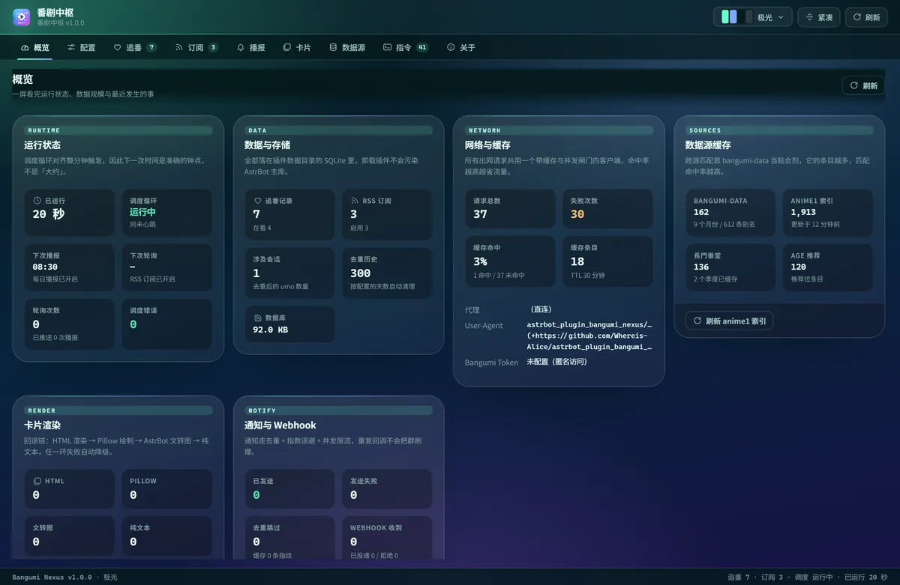
</p>

| 视图 | 你能在这里做什么 |
| --- | --- |
| **概览** | 运行状态一屏看完：数据源统计、HTTP 缓存命中率、调度器下次执行时间、推送成功/失败计数、活动日志（可按级别过滤）；还有「刷新 anime1」「立即播报」「立即抓取 RSS」「Webhook 自测」几个一键操作 |
| **配置** | 71 项配置按 11 组编辑，开关/滑块/下拉/多行文本各按类型给控件，带说明与默认值提示。密钥类字段只显示「已配置」不回显 |
| **追番** | 选一个会话，改进度、改状态、打分、写备注、删条目；也能直接在这里搜名字加进追番表 |
| **订阅** | 增删订阅、单条测试抓取、批量启停、导出 JSON / 粘贴导入；还能**只填番名点「列字幕组」**从 Mikan 候选里挑一个订上，以及勾选**本会话排除项**并一键回写到已有订阅 |
| **播报** | 配置推送目标、查看「自助订阅」进来的会话、按指定星期手动触发一次播报 |
| **卡片** | 6 主题 × 4 种卡片的**真实渲染**预览，点开可放大到原始像素、可下载 PNG。改主题前先来这里看长相 |
| **数据源** | 8 个数据源逐个体检，给出耗时与失败原因，一眼看出是哪个站挂了 |
| **指令** | 全部 42 条指令速查表，按分类分组，显示别名与权限要求 |
| **ani-rss 同步** | 填地址与凭据、测连接、指定同步进哪个会话、四个开关与间隔就地改、点一下立刻同步，并列出已认领的条目与上次同步账目 |
| **关于** | 版本、限额、安全提示、数据源致谢 |

### 面板长什么样

| | |
| :--: | :--: |
| 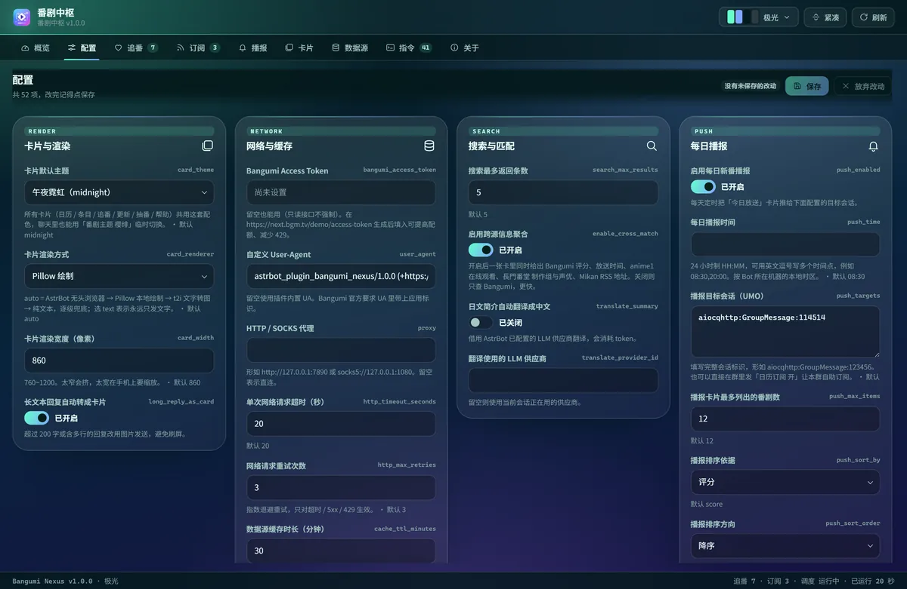 |  |
| **配置** · 71 项分 11 组，控件按类型自动匹配 | **追番** · 进度 / 状态 / 评分 / 备注就地改 |
| 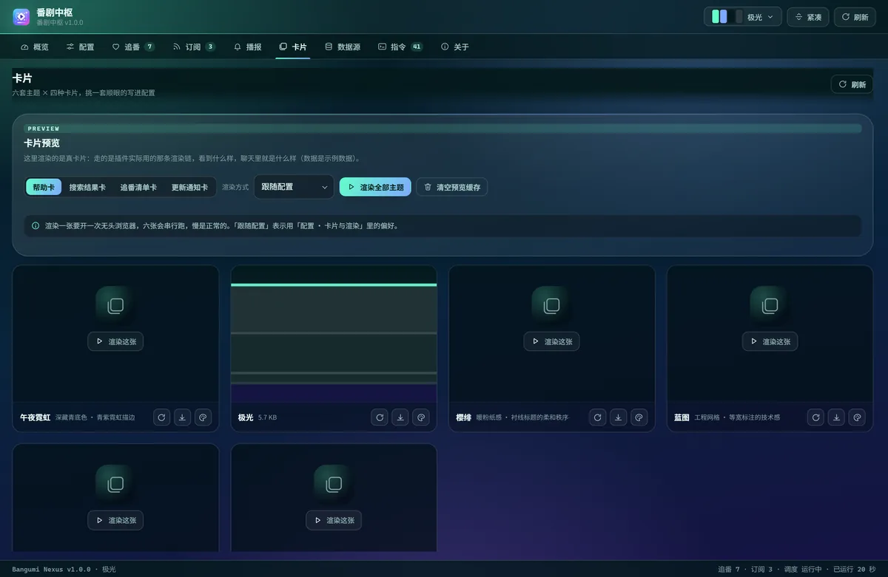 | 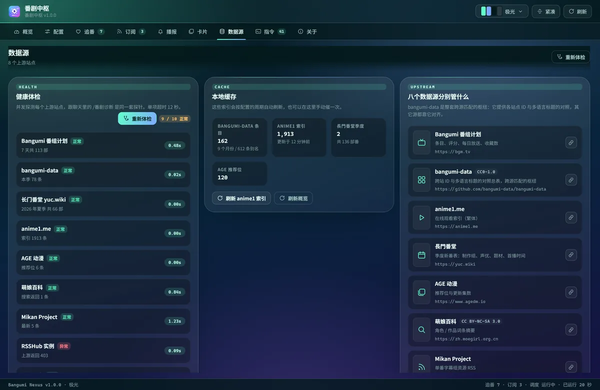 |
| **卡片** · 6 主题 × 4 版式真实渲染预览 | **数据源** · 8 个源逐个体检，给耗时与失败原因 |
| 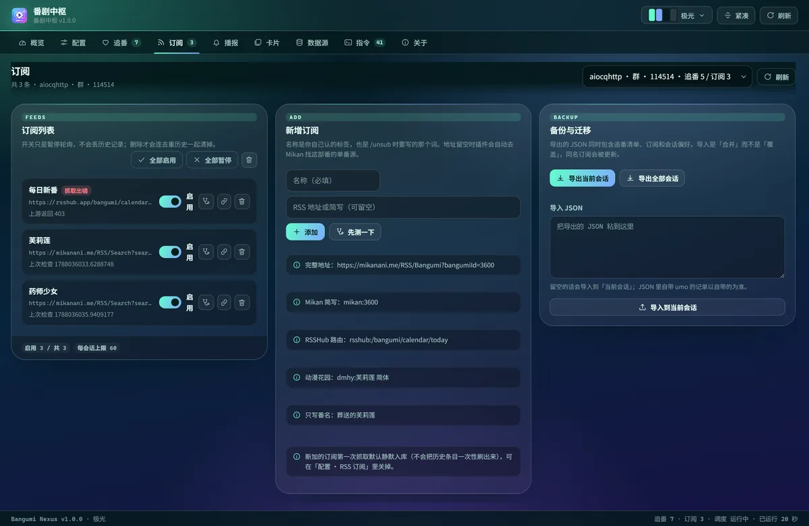 | 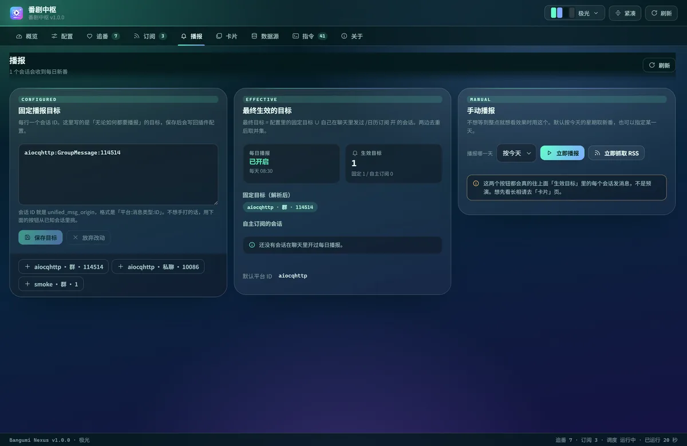 |
| **订阅** · 增删、单条测试、批量启停、导入导出 | **播报** · 推送目标与自助订阅会话管理 |

订阅视图里的两块新面板，等价于聊天里的 `/sub` 选源与 `/sub_exclude`，但不用记指令：

- **挑一个字幕组** —— 在「新增订阅」里只填番名、点「列字幕组」，下面会展开 Mikan 上的候选（带最后更新日、语言 / 画质标签、RSS 地址），点「订阅这个」直接落库。
- **排除项** —— 顶上是只读的**全局层**（在配置页设，所有会话都吃），下面 16 个内置预设是一排开关，另有自定义词输入框（逗号 / 空格分隔都认）。底部实时预览两层合并后真正参与过滤的关键词，并显示同集归并当前的开关与优先顺序；「保存改动」只存本会话偏好（影响以后新增的订阅），「回写到已有订阅」才会刷到当前会话已有的订阅上。

指令视图会把 42 条指令按 6 个分类整张摊开，别名和权限都在表里：

<p align="center">
  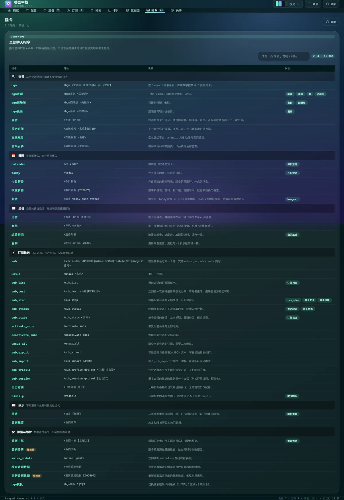
</p>

### 6 套主题

面板本身也有 6 套主题（和卡片同名同配色），右上角随时切换；还有一个紧凑模式，屏幕小的时候能多塞点内容。
**界面偏好存在后端**，所以换浏览器、换设备打开也是你上次的样子。

<p align="center">
  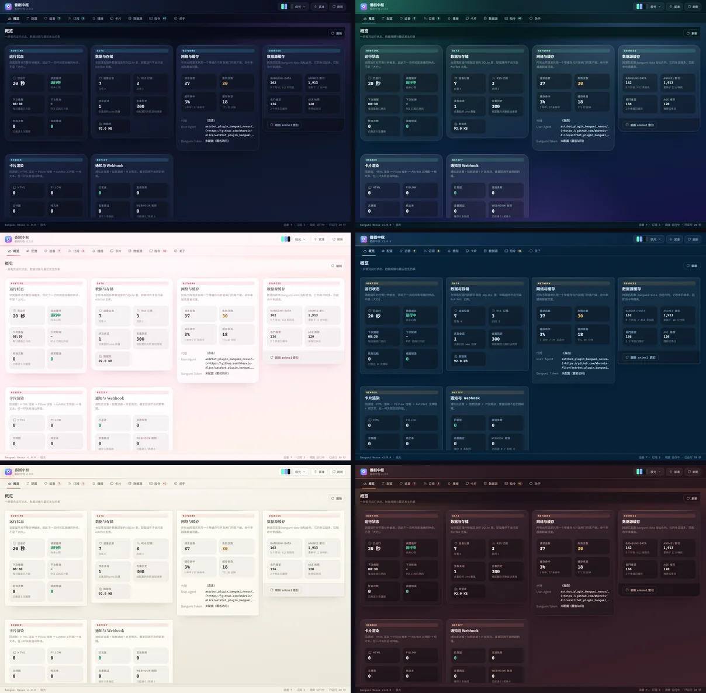
</p>

<p align="center"><sub>从左上到右下：午夜霓虹 · 极光 · 樱绯 · 蓝图 · 素笺 · 落日</sub></p>

窄屏会自动折成单列，手机上也能改配置、点一次播报：

<p align="center">
  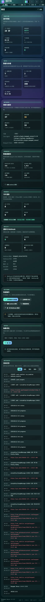
</p>

---

## 卡片渲染是怎么兜底的

聊天平台对图片友好，对长文本不友好，所以插件的默认输出是卡片。但渲染是最容易出问题的一环，
因此设计了一条 4 级降级链：

```
html    AstrBot 自带无头浏览器渲染 HTML 模板（最好看，15 套版式）
  ↓ 连续 3 次失败
raster  Pillow 本地绘制（不依赖浏览器，样式简化但信息完整）
  ↓ Pillow 缺失或字体不可用
t2i     AstrBot 的文字转图服务
  ↓ 服务不可用
text    纯文本（永远可用的最后一站）
```

几个实现细节：

- `auto` 模式下，HTML 渲染连续失败 3 次会进入 **120 秒冷却**，期间直接走 Pillow，不再反复撞墙。冷却结束自动恢复。
- 渲染结果按内容哈希缓存在插件数据目录，**最多 240 个文件 / 保留 6 小时**，超出自动清理，不会无限堆盘。
- 番剧封面单独缓存 30 天，单张上限 4 MB。
- 想彻底关掉图片，把 `card_renderer` 设成 `text` 就行，所有功能都会退化成纯文本，不会缺功能。

---

## 让通知有「人味」

这是本插件和其它番剧插件最不一样的地方。

传统做法是：新集出了 → 发一条模板消息。结果就是群里多了一个机械播报员。

番剧中枢的做法是：新集出了 → **把这条通知交给你的 Bot 人格，让它用自己的口吻说一句** → 人格的话 + 信息卡片一起发。

```
【樱酱】芙莉莲第 12 集出啦，字幕组这次很快嘛～今晚一起看？
[附：更新通知卡片]
```

配置要点：

- `persona_reply_enabled` 默认开启。
- `persona_id` 留空 = 跟随目标会话当前的默认人格，也就是说**你在哪个群设了什么人格，播报就是什么口吻**。
- `persona_provider_id` 留空 = 用目标会话当前正在用的 LLM 供应商。
- `persona_instruction` 只写「要做什么」（转述这条通知），**不要在里面写人设** —— 人设归 AstrBot 的人格系统管，
  这样你换人格时不用来改插件配置。
- 拿不到人格或供应商时**自动跳过转述、只发卡片**，不会因为 LLM 挂了就丢通知。
- `persona_max_chars` 限制转述长度（默认 180 字），防止人格发挥过头把卡片挤到看不见。

覆盖范围：每日新番播报、RSS 更新推送、Webhook 事件通知。

---

## RSS 订阅

### 四种写法

```
/sub 芙莉莲 https://mikanani.me/RSS/Bangumi?bangumiId=3141   完整地址
/sub 芙莉莲 mikan:葬送的芙莉莲                                 Mikan 搜索
/sub 每日新番 rsshub:bangumi/calendar/today                    RSSHub 路由
/sub 芙莉莲 dmhy:葬送的芙莉莲                                  动漫花园搜索
/sub 葬送的芙莉莲                                              只给名字，自动去找源
```

最后一种是推荐用法，也是默认行为：只给番名，插件会去 Mikan 找这部番收录了哪些字幕组，列出来让你挑一个。

### 为什么要挑字幕组

Mikan 的关键词搜索源会把**所有字幕组、所有语言、所有画质**的发布一起收下。
一集番同时有简体 / 繁体、720p / 1080p、内嵌 / 外挂，于是「订阅一部番」实际等于「每集被推七八条」。
上游插件基本都是这个行为，所以这里改成先选源：

```
你：/sub 名侦探光之美少女

Bot：名侦探光之美少女 · 找到 5 个字幕组，回复序号订阅
     1. 雪飘工作室          最后更新 2026-08-29
     2. Kirara Fantasia    最后更新 2026-08-28
     3. LoliHouse           最后更新 2026-08-28
     ...

你：1

Bot：已订阅 名侦探光之美少女（雪飘工作室）
     （上面那条候选列表会被自动撤回）
```

- 订上的是**单组 RSS**（`/RSS/Bangumi?bangumiId=xxx&subgroupid=yyy`），一集只推一条。
- 候选列表 **3 分钟**过期，同一会话再发起一次会顶掉上一次。
- 一部番的组太多时只列前 12 个，按最后更新时间排。
- `/追番 <名称>` 之后也会跟一次同样的候选列表，回序号即可顺手订上。
- 想回到「一次收下所有组」的老行为，把配置项 `rss_pick_source` 关掉即可。

### 排除项与同集归并

选了单组之后还是会有重复：同一个组常把同一集的**简体 / 繁体、1080p / 720p、Baha / ABEMA** 各发一遍。
插件用两个互补的手段解决 —— 排除项负责「我永远不想看到这种版本」，同集归并负责「这一集给我挑一条就好」。

#### 三层排除项

过滤按这个顺序叠加，任意一层命中就直接丢掉，不推、不入库：

| 层 | 在哪里设 | 作用范围 |
| --- | --- | --- |
| **全局层** | 配置项 `global_excludes`（Dashboard / 管理页） | 所有会话、所有订阅，无条件生效 |
| **会话层** | `/sub_exclude`，或管理页的「排除项」面板 | 当前会话的所有订阅 |
| **单条订阅** | 管理页订阅行的编辑，或用 `/sub_exclude apply` 把会话词表回写进去 | 只影响那一条订阅 |

先在配置项里把「这台 Bot 一律不要的东西」设一次（比如繁体、合集），之后新加的群不用再设一遍；
个别群口味不同，再用 `/sub_exclude` 在它之上加严：

```
/sub_exclude              看两层清单与合并后的实际过滤词
/sub_exclude preset       列出内置预设，按名字勾
/sub_exclude add 繁体     加一个词（也可以直接写预设名，会自动展开）
/sub_exclude del 繁体     删一个词
/sub_exclude apply        把本会话词表刷到已有订阅上
/sub_exclude clear        清空本会话词表
```

内置预设 16 组，写预设名会自动展开成一串同义写法，省得逐条手打（同一件事字幕组能写出四五种花样，只写字面量等于没过滤）：

| 预设 | 展开成 |
| --- | --- |
| `简体` | 简体、简日、简中、CHS、`[GB`、`[SC]`、`SC]` |
| `繁体` | 繁体、繁日、繁中、CHT、BIG5、`[TC]`、`TC]` |
| `简繁` | 简繁、繁简、CHS&CHT、CHT&CHS、GB&BIG5、BIG5&GB |
| `720p` / `1080p` / `2160p` | 分辨率的两种写法（如 `1080p` 与 `1920x1080`） |
| `Baha` / `ABEMA` | Bahamut / ABEMA 片源标识 |
| `CR` | Crunchyroll、`[CR]`、`(CR)`、`CR `（末尾那个空格是故意的，见下） |
| `B-Global` | B-Global、BGlobal、Bilibili |
| `内嵌` / `外挂` | hardsub / softsub、内封、`[ASS` |
| `MKV` / `MP4` | 容器格式 |
| `合集` | 合集、Batch、BDRip |
| `生肉` | 生肉、无字幕、`[RAW]`、`(RAW)`、`RAW ` |

匹配是大小写不敏感的**子串**匹配，因此有两条容易踩的规则，插件已经替你处理好：

- **双语单文件不会被单语排除项误杀。** `[喵萌][…][简繁日内封]`、`[桜都][…][CHS&CHT]` 这种一个文件里
  同时封了简繁的发布，勾了 `繁体` 也照样推给你 —— 它本来就带着你要的简体，丢掉等于整集收不到。
  真想连双语单文件一起躲，勾 `简繁` 那一组，那是这个豁免唯一的出口。
- **短缩写自带边界，不会误伤正常标题。** 预设里写的是 `[CR]` / `CR ` 而不是裸 `CR`，否则
  `Secret`、`Sacred` 里的 `cr` 都会命中；`生肉` 写的是 `[RAW]` / `RAW ` 而不是裸 `Raw`，
  否则 `[NC-Raws]`、`[Lilith-Raws]` 两个大组的全部发布会被打死；`简体` 只收 `[GB` 而不收 `GB]`，
  否则 `[2.1GB]` 这类体积标注会中招。**自己手写关键词时请照这个思路带上边界。**

会话层的排除词**新加的订阅自动套用**；已经存在的订阅不会被偷偷改写，需要显式 `apply`（或在管理页点「回写到已有订阅」）。
全局层不需要回写 —— 它在每轮轮询时现取，改完立刻对所有订阅生效，包括老订阅。

#### 同集归并（默认开启）

一部番订的组固定之后，同一集还是会来好几条。默认做法是**都收下，只推一条**：

- 从标题里认出「哪部番的第几集」（认得出 `第01话`、`S01E05`、`[01]`、`- 01`、`EP01` 等写法）；
- 同一集的多个版本按 `rss_episode_prefer` 打分，只推最合口味的那一条，其余静默跳过并一起记入已读；
- `01v2` 这类修订版永远压过原版；
- 认不出集数的条目（剧场版、合集、字幕组公告）**原样保留** —— 宁可多推一条，也不能让它们互相顶掉。

默认优先顺序是 `简体 > 1080p > Baha > MKV > 外挂`，且**靠前的一项压得住后面所有项之和**：
你把 `简体` 放第一位，就不会因为另一条是「1080p + MKV + 外挂」而收到繁体版。想反过来（先要画质）
就把 `1080p` 挪到最前面。

通知卡片下方会写明「同一集的另外 N 个版本已自动合并」，所以合并了什么不会是黑箱。
不想要这个行为，把 `rss_episode_dedup` 关掉即可。

**归并的语义是「先到先得」，这一点很重要。** 同一个字幕组从 Baha / ABEMA / CR / B-Global 各压一版时，
四版**不是同时发的**，实测能差一到五天（同一部番同一集，CR 比 Baha 早一天、ABEMA 比 Baha 晚五天都出现过）。
所以哪一版先进 feed，推的就是它 —— `rss_episode_prefer` 只在**同一批**里多版本同时到达时才分得出高下。
**想稳定锁定某个片源（例如只要 Baha），靠归并做不到，要用排除项把其它片源挡掉。**

跨天发布还带来第二个问题：光在单次轮询内归并的话，先到的 CR 当轮推走，第二天 Baha 到了会被当成全新条目再推一次，
一集推两遍。`rss_episode_dedup_window_hours`（默认 **48** 小时）解决这个：某一集推过之后，窗口内再到的
同集其它版本静默跳过，通知里会写「另有 N 条是之前推过的那一集的其它版本，已跳过」。
`01v2` 这类修订版不受窗口影响，照推。48 小时是折中值 —— 覆盖得住跨天发布，又短于周更番的 7 天间隔，
不会把下周的同号集误判成重复。填 `0` 退回只在单次轮询内归并的旧行为。

> 插件**不做**「等 Baha 出了再推」的延迟等待：CR 与 Baha 能差一整天，等待窗口就得开到 24 小时以上，
> 等于所有通知统统晚一天，代价远大于收益。要指定片源就用排除项，这是可控的做法。

> 归并只在**同一个字幕组**内部进行，跨组不合并。同一部番订了多个组时请在选源那一步收敛（`/sub 番名` 挑一个组），
> 因为「两个组的第 5 集」在标题上无法可靠判定是同一集，猜错就是静默丢消息。

#### 全局层到底该填什么

先说一类**无条件放全局层**的：任何形式都不想要的东西 —— `合集`、`生肉`、`内嵌`，介意流量的再加 `720p`。
这些命中即丢，不存在「丢了就整集收不到」的风险。

片源（`Baha` / `ABEMA` / `CR` / `B-Global`）该放排除项还是交给归并，**取决于你订的是哪种源**：

| 你的订阅 | 怎么做 | 为什么 |
| --- | --- | --- |
| **单组单番**：用 `/sub 番名` 选源建的，某个组稳定同时发四个片源的版本 | 把不想要的片源填进全局排除项，只留一个 | 这是排除项**最正当的用法**。归并是先到先得，不保证留下你要的那一版；排除项能真正锁定 |
| **宽 feed**：关键词搜索、`dmhy:` 全站源，一条 feed 里混着多个组 | 片源和语言别放全局层，交给同集归并 | 不同组的出片节奏差很多，硬屏蔽片源会让某天整集收不到 |

也就是说，如果你只订了「`[黒ネズミたち]` 的碧蓝之海 3」，而这个组每集都会出 Baha / ABEMA / CR / B-Global 四版，
那么在全局层填 `ABEMA`、`CR`、`B-Global` 只留 Baha，**是正确的填法**，比指望归并挑对更可控。

两个提醒：

- `B-Global` 这个预设展开后含 `Bilibili`，会连带打死 `[Up to 21°C]`、`[NC-Raws]` 这类**简日双语**发布。
  如果你还订着这些组，把 `B-Global` 换成手写 `B-Global` / `BGlobal` 两个词，别用预设。
- 语言词（`简体` / `繁体`）**不是一刀切**：只有单语标记（`[CHT]`、`[繁日双語]`、`BIG5`）会被拦，
  `简繁日内封`、`CHS&CHT`、`[CHS][CHT]` 这类双语单文件一律豁免放行。详见上面[三层排除项](#三层排除项)那节。

### 推送顺手回填追番进度

`rss_auto_progress`（默认开）。一条 RSS 更新推送成功后，插件会从标题里解析集号，
把追番表里**标题最接近的那一条**的进度推到该集：

```
[Sub组] 药屋少女的呢喃 第二季 - 07 [1080p][简体]   ← RSS 推送
        ↓ 解析出「07」，标题匹配度 0.72 以上才认
追番列表  药屋少女的呢喃 第二季   6/24  →  7/24     ← 自动往前推一集
```

规则写得比较保守，避免帮倒忙：

- **只往前推。** 已经看到第 10 集，再收到第 7 集的补档不会把进度拽回去。
- **不超过总集数。** 拿到总集数的番，进度最多推到最后一集。
- **一部番只认一条记录。** 同一会话里有多条相似标题时只取匹配度最高的那条，不会一次改一片。
- **已弃坑的不动。** 标成弃坑的番不会因为一条推送就悄悄复活。
- **SP / OVA 不算集数。** 解析不出正整数集号的发布直接跳过。

下载器 Webhook（`webhook_auto_progress`）与 ani-rss 同步共用同一套回填逻辑，三条来源不会互相打架。

### 会遇到的坑，插件都处理了

| 坑 | 处理方式 |
| --- | --- |
| 刚订阅就被推 50 条历史 | `rss_first_poll_silent` 默认开启：首轮只入库不推送 |
| 某个源一次吐出几十条 | `rss_max_items_per_poll` 限流（默认 5 条），超出只记录 |
| 同一条被重复推送 | 去重库按条目唯一标识 + `dedup_window_seconds` 时间窗双重拦截 |
| 源挂了之后每轮都报错刷屏 | 同一个源的错误**只报一次**，恢复后才会再提醒 |
| 高频轮询被目标站封 | 最小间隔硬限制 5 分钟，全局并发上限可配 |
| 去重库越来越大 | 按 `rss_history_days`（默认 14 天）自动清理 |

### 换群不用重配

```
/sub_export          导出成 JSON 文本
/sub_import <JSON>   贴到新群里导入，重名自动跳过
```

追番表也一起导出，搬家很省事。

---

## Webhook 接入（AutoBangumi 等下载器）

如果你在用 AutoBangumi / qBittorrent 之类的自动追番下载器，可以让它在「下载完成 / 整理入库」时直接通知 Bot。

**1. 开启并设置令牌**

配置 → Webhook 接入 → 打开 `webhook_enabled`，`webhook_token` 填一个自己编的长字符串。

**2. 选一条通道**

| 通道 | 地址 | 什么时候用 |
| --- | --- | --- |
| 面板路由 | `http(s)://<AstrBot>/api/plug/astrbot_plugin_bangumi_nexus/notify` | 面板自测用。**这条路由受 Dashboard 登录态保护**，外部程序直连会 401 |
| 独立端口 | `http://<AstrBot主机>:<webhook_port><webhook_path>` | **推荐给下载器用。** 把 `webhook_port` 设成一个空闲端口（如 `9520`），插件会额外起一个只处理 Webhook 的极简 HTTP 服务 |

**3. 在下载器里填**

请求头带上 `X-Webhook-Token: <你设的令牌>`，body 是下载器自己的 JSON，插件会自动识别 6 种常见事件类型。

> **安全约束：** `webhook_port > 0` 但 `webhook_token` 为空时，监听服务会**拒绝启动**并在日志里报错。
> 这是故意的 —— 一个不校验令牌的公网端口等于让任何人往你群里发消息。
> 与下载器同机时建议把 `webhook_bind` 改成 `127.0.0.1`。

**4. 两个加分项**

- `webhook_notify_watchers`（默认开）：除固定目标外，**追番表里收录了这部番的会话**也会收到通知。
  一台下载器服务好几个群时，各群只收自己关心的番。
- `webhook_auto_progress`（默认关）：新集入库时自动把追番进度推到该集。只往前推，不会回退。

---

## ani-rss 同步（把本地下载器的订阅搬进来）

如果你已经在用 [ani-rss](https://github.com/wushuo894/ani-rss) 追番，那「我在追哪些番、下到第几集」这份名单其实已经存在了 ——
没必要再在群里一部部 `/追番`。打开这个功能，插件会定时去读 ani-rss 的订阅列表，把它变成自己的追番表。

**设计上只做三件事，也只做这三件事：**

| 约束 | 为什么 |
| --- | --- |
| **单向只读** | 绝不回写 ani-rss。下载器的配置是你的资产，插件没有资格改 |
| **不自动删** | ani-rss 里删掉的条目，这边只报「已失联」并保留记录。地址填错一次就清空整张追番表，代价太大 |
| **进度只往前** | ani-rss 的「已下载到第几集」和你「实际看到第几集」是两件事，取两者较大值 |

### 三步配好

**1. 拿凭据**

ani-rss 设置页里复制 API Key，填进 `anirss_api_key`。没开 API Key 的话也可以填 `anirss_username` + `anirss_password`，
插件会自己登录换 token（但 ani-rss 的登录接口是明文提交，公网暴露请优先用 API Key）。

**2. 填地址**

`anirss_base` 填 `http://<ani-rss主机>:7789`，末尾的 `/api` 可以省略。
AstrBot 跑在服务器、ani-rss 跑在自己电脑上时，要填一个服务器能访问到的地址 —— 局域网 IP 或打了洞的公网地址。
填完先发 `/anirss test`，会直接告诉你连不连得上、认到几条订阅。

**3. 指定同步进哪个会话**

追番表是**按会话分开存**的，所以必须告诉插件同步到哪儿。`anirss_sync_targets` 填完整会话标识，
形如 `aiocqhttp:GroupMessage:123456`（管理页的「播报」视图里能直接看到候选会话）。
填完打开 `anirss_enabled`，之后每 `anirss_sync_interval_minutes` 分钟自动同步一次（默认 60，填 `0` 表示只手动同步）。

### 同步到底做了什么

```
ani-rss 订阅列表
  ├─ 药屋少女的呢喃 第二季   已下载 7 集   bgm.tv/subject/425909
  └─ 无路可逃                已下载 3 集   bgm.tv/subject/512345
          │
          │  先看认领关系，没有再按标题找（精确 → 包含）
          ▼
追番表（anirss_sync_targets 指定的会话）
  ├─ 药屋少女的呢喃 第二季   6/24 → 7/24   ✎ 进度前进
  └─ 无路可逃                — → 3/12      ✚ 新增
```

每条条目会记一条**认领关系**（ani-rss 的条目 ID ↔ 追番记录 ID）。有了它，你在群里手动改过标题、
或者 ani-rss 那边改了番名，下一次同步也不会重复插一条新的。

### 四个开关

| 开关 | 默认 | 说明 |
| --- | --- | --- |
| `anirss_sync_watchlist` | 开 | 写进追番表并回填进度。关掉就只做连接与查看，不落库 |
| `anirss_sync_subscriptions` | **关** | 顺便建立 RSS 订阅。**多数人不该开** —— ani-rss 自己已经在轮询这些 RSS 了，插件再订一遍会收到两份通知。只有「下载归 ani-rss、通知归 AstrBot」的玩法才需要 |
| `anirss_notify_on_change` | 开 | 有变化（新增 / 进度前进 / 失联）时发一张同步账目卡；没变化时静默 |
| `anirss_verify_tls` | 开 | 只有用自签证书反代时才需要关 |

> 同步账目走的是**独立推送链**，只发到 `anirss_sync_targets` 指定的会话，绝不会混进 RSS 更新那条推送链 ——
> 那条链是给「有新集了」用的，把同步账目刷进去会吵。

### 配合 `push_only_watchlist` 的完整玩法

```
电脑上的 ani-rss 点订阅  →  插件同步进追番表  →  每日播报只播追番表里的番
                                            →  RSS 更新推送也只推我追的番
```

打开 `push_only_watchlist` 后，「今日新番」播报只会列出追番表里有的番。于是整条链变成：
**录入口只有一个（ani-rss），群里收到的全是自己真在追的。**

### 相关指令

```
/anirss           看同步状态：连接情况、上次同步账目、已认领的条目
/anirss sync      立刻同步一次（仅管理员）
/anirss test      只测连接，不写库（仅管理员）
```

管理页的「ani-rss 同步」视图把这些都做成了按钮，地址、凭据、目标会话、四个开关和间隔都能就地改。

---
## 数据源与致谢

这个插件本身不存储、不缓存、不分发任何影音内容，只做信息索引。全部数据来自下列公开来源，版权归各自站点与权利人所有。

| 数据源 | 提供什么 | 地址 |
| --- | --- | --- |
| **Bangumi 番组计划** | 条目、评分、每日放送、在看人数、分集列表 | <https://bgm.tv> |
| **bangumi-data** | 跨站 ID 与多语言标题对照总表（本插件的匹配枢纽），CC0-1.0 | <https://github.com/bangumi-data/bangumi-data> |
| **長門番堂** | 季度新番表：制作组、声优、题材、首播时间 | <http://yuc.wiki> |
| **AGE 动漫** | 推荐位与更新集数 | <https://www.agedm.io> |
| **anime1.me** | 在线观看索引（繁体） | <https://anime1.me> |
| **萌娘百科** | 作品与角色词条摘要，CC BY-NC-SA 3.0 | <https://zh.moegirl.org.cn> |
| **Mikan Project** | 单番字幕组资源 RSS | <https://mikanani.me> |
| **RSSHub** | 万物皆可 RSS | <https://docs.rsshub.app> |

感谢这些站点长期免费提供数据。请合理设置轮询间隔（默认值已经很保守），不要给它们添麻烦。

---

## 与上游插件的关系

番剧中枢是在下面 6 个开源插件的基础上重写与融合而成的，**指令名保持兼容**，但内部实现是全新的。
向原作者致谢：

| 上游插件 | 借鉴了什么 |
| --- | --- |
| [NoFizz/astrbot_plugin_bangumi_calendar](https://github.com/NoFizz/astrbot_plugin_bangumi_calendar) | 每日放送卡片、封面并发抓取与缓存清理策略、`/新番` 指令组 |
| [united-pooh/astrbot_plugin_bangumi](https://github.com/united-pooh/astrbot_plugin_bangumi) | `/bgm` 系列搜索、日文简介翻译、长回复转卡片、`/追番` `/弃坑` `/放送时间` |
| [Yometenma/astrbot_plugin_autobangumi_notify](https://github.com/Yometenma/astrbot_plugin_autobangumi_notify) | AutoBangumi Webhook 事件解析、目标会话拼装、指数退避与去重 |
| [zhist2028/astrbot_plugin_anime1_list](https://github.com/zhist2028/astrbot_plugin_anime1_list) | anime1.me 列表抓取与观看地址解析、`get_anime_list` / `get_watch_url` 函数工具 |
| [FlanChanXwO/astrbot_plugin_rsshub](https://github.com/FlanChanXwO/astrbot_plugin_rsshub) | RSS 订阅指令体系（`/sub` 全家桶）、RSSHub 路由简写 |
| [xco2/astrbot_plugin_anime_gacha](https://github.com/xco2/astrbot_plugin_anime_gacha) | `/抽番` `/查番`、萌娘百科查询、季度数据维护指令（`/今日新番` 现在是 `/today` 的别名） |

### 融合时顺手修掉的问题

- **定时不准**：上游用裸 `asyncio.sleep(间隔)` 累积漂移。改为对齐整分钟的调度循环，长期运行也不会跑偏。
- **写文件到插件目录**：封面缓存曾落在插件安装目录，更新插件就丢。改用 `StarTools.get_data_dir()`。
- **同步阻塞**：`requests` 同步调用会卡住事件循环。全面换成 `httpx` 异步，配统一的并发闸门与指数退避。
- **`self.logger` 不存在**：某些上游代码在 AstrBot 新版本会直接抛异常。统一改用 `from astrbot.api import logger`。
- **Webhook 401**：`register_web_api` 注册的路由在 AstrBot 4.25 一律受面板登录态保护，外部下载器直连必然失败。
  改为双通道，另给一个独立端口（强制令牌校验）。
- **重依赖**：上游合计需要 `apscheduler` / `rdflib` / `html2text` 等。本插件只留 4 个轻依赖，
  定时器、SQLite、Webhook 服务全部用标准库实现，`feedparser` 也做了 stdlib 兜底。
- **刷新时段写成负数被静默吞掉**：解析「刷新小时」时上游直接抽走所有非数字字符，`-1` 会变成 `1`，
  于是本想禁用的时段反而在凌晨 1 点触发。现在带符号的写法一律判为无效并跳过。
- **番剧封面 404**：站点返回的相对路径（`/x.jpg`）被拼成 `https:/x.jpg`，封面全挂。
  现在统一按 `http(s):` / `data:` / `//` / 相对路径四种形态补全域名。
- **「官网」被当成首播时间**：详情表里找不到时间时，上游会兜底截取单元格前 60 个字符，
  结果把「官网」两个字当放送时间推给用户。现在只在明确的时间字段里取值，取不到就留空。
- **日历里有、详情表里没有的番会整条丢失**：现在以日历表为准补齐条目，至少保证番名和封面在卡片上出现。
- **「订阅一部番」等于被刷屏**：上游用 Mikan 的关键词搜索源，一次收下所有字幕组 / 语言 / 画质，一集能推七八条。
  现在默认先列候选让用户挑一个组，订上的是单组 RSS；再配一层可勾选的排除词表兜住简繁、合集、生肉这类重复。

### 没有迁移的功能

`astrbot_plugin_rsshub` 的 4 个知识库指令（`rsshub_kb_*`）**没有迁移**。它们依赖那个插件自建的一整套向量知识库
与检索管线，和本插件「轻量、少依赖」的取向冲突，硬搬过来会引入一大堆重依赖。

替代方案：用 `/sub_export` 导出订阅数据，再从 Dashboard 的知识库功能导入 —— AstrBot 本体的知识库比插件自建的更通用。

---

## 安全提示

请认真读这一节，尤其是准备把 Bot 放到公网的情况。

- **不要把 AstrBot Dashboard 直接暴露在公网。** 面板拥有插件配置的完整读写权限。需要远程访问请走反向代理 + 强密码，
  或者干脆只在内网/VPN 里访问。
- **开了 `webhook_port` 就必须设 `webhook_token`。** 插件会强制这一点（不设直接拒绝启动），但请同时确认这个端口
  没有被暴露到公网。
- **`bangumi_access_token` 属于凭据。** 它在面板与管理页里都不回显，导出的 JSON 里也不包含。请不要把它贴到 issue 里。
- **`/sub_import` 会写入当前会话的数据。** 只导入你自己导出的 JSON，别执行来源不明的内容。
- **管理员指令**（`/番剧诊断`、`/更新番剧数据`、`/新番 push`、`/新番 status`）走 AstrBot 自身的权限体系，
  请确认你的管理员名单是对的。
- **TLS 宽松名单只有一个域名。** 長門番堂（`yuc.wiki`）长期只挂半条证书链，部分系统补不齐中间证书会直接握手失败，
  于是「季度新番数据」这一路整个哑掉。插件对这个域名（含子域）允许在校验失败时降级重试一次，
  **名单硬编码在代码里、不开放给配置**：能降级的站点必须人工确认，而且它只提供公开只读数据。
  其它所有请求仍然严格校验证书。

---

## 常见问题

**卡片发不出来 / 只有文字？**
先在管理页的「卡片」视图点一下渲染，看报什么错。最常见的原因是 AstrBot 的无头浏览器渲染不可用 ——
这种情况下插件会自动降级到 Pillow，如果连 Pillow 也没装（`pip install Pillow`），就只剩文字了。

**搜不到某部番？**
换个写法试试：中文名、日文原名、罗马音都支持，季数写「第二季」「2nd Season」「S2」都能对上。
还是不行就 `/bgm <关键词>` 直接搜 Bangumi 看看条目到底叫什么。

**订阅了但没收到推送？**
按顺序查三件事：① `/sub_status` 看轮询任务是不是在跑；② `/sub_state <名称>` 看这个源上次抓取有没有报错；
③ 确认没有执行过 `/sub_stop`（用 `/activate_subs` 恢复）。

**同一集被推了好几条？**
说明订的是「一部番的全部字幕组」。用 `/unsub <名称>` 退掉，再 `/sub <番名>` 走一次选源流程挑一个组。
如果是同一个组把简繁 / 画质 / 多个片源各发一遍，先确认配置项 `rss_episode_dedup` 是开着的（默认开，同一集只留一条），
并且 `rss_episode_dedup_window_hours` 不是 `0`（默认 48 小时，负责拦住**跨天才到**的同集其它片源）。
想彻底锁定某个片源，用 `/sub_exclude preset` 勾掉不要的，或在配置项 `global_excludes` 里一次设好全部会话。

**每日播报没发？**
`push_enabled` 打开了吗？`push_targets` 或 `/日历订阅 开` 至少要有一个。管理页的「播报」视图里能看到
「生效目标」列表，空的就是没配上。另外播报时间用的是 **Bot 所在机器的本地时区**。

**ani-rss 同步点了没反应 / 报连不上？**
先发 `/anirss test`，它会分别告诉你「地址对不对」「凭据认不认」「读到几条订阅」。三种常见原因：
① AstrBot 在服务器、ani-rss 在家里的电脑上，服务器根本访问不到 `127.0.0.1:7789` —— 得填一个可达地址；
② `anirss_sync_targets` 是空的，自动同步会直接跳过（手动 `/anirss sync` 会落到当前会话）；
③ API Key 填了但 ani-rss 那边没启用鉴权，反而会 401，清空 `anirss_api_key` 再试。

**ani-rss 里删掉的番，插件这边还在？**
故意的。同步只报告成「已失联」并保留记录，不自动删 —— 地址一旦填错，自动删会把整张追番表清空。
要删就在管理页的「追番」视图或 `/弃坑` 手动处理。
**请求老是超时？**
上面几个数据源里有一部分在国内直连不畅。填 `proxy`（支持 `http://` 和 `socks5://`），或者把 `mikan_base` /
`rsshub_base` 换成可用的镜像。`/番剧诊断` 能告诉你具体是哪个源卡住。

**会不会太吃资源？**
默认配置下的常态开销很小：RSS 每 15 分钟一轮、anime1 列表一天刷 3 次、慢变数据内存缓存 30 分钟、
并发上限 5。最重的操作是 HTML 卡片渲染，而它有缓存和冷却保护。

**能只当查询工具，不要任何定时任务吗？**
可以。关掉 `push_enabled`、`rss_enabled`、`webhook_enabled`、`anime1_enabled`、`anirss_enabled`，插件就只在你发指令时才动。

---

## 开发

```
astrbot_plugin_bangumi_nexus/
├── main.py                 指令层：42 条指令 + 4 个函数工具，只做「事件 ↔ 服务」翻译
├── nexus/
│   ├── config.py           71 项配置的解析与校验
│   ├── http.py             统一 HTTP 客户端：重试 / 缓存 / 并发闸门 / 统计
│   ├── store.py            SQLite 持久层（全异步）
│   ├── titles.py           标题归一化、季度换算、放送周期解析
│   ├── catalog.py          指令目录（帮助卡与管理页共用同一份数据）
│   ├── sources/            8 个数据源适配器，一个源一个文件
│   ├── services/           业务层：搜索 / 追番 / 订阅 / 通知 / 调度 / Webhook / ani-rss / 体检
│   ├── render/             6 主题 + 15 套 HTML 模板 + Pillow 兜底 + 降级引擎
│   └── web/                管理页后端（35 条路由）与独立 Webhook 监听
├── pages/nexus/            管理页前端（原生 JS，无构建步骤）
├── tests/                  纯函数单测（标题归一化 / 季度换算 / RSS 解析 / 配置强转 …）
└── assets/                 Logo、卡片预览图、管理页截图
```

几条内部约定，改代码前值得知道：

- **服务层不依赖 AstrBot SDK。** `nexus/services/` 只接收一个 `Deps` 容器、只返回 `Reply` 对象，
  由 `main.py` 翻译成消息链。所以服务层可以脱离 AstrBot 单独跑测试，`tests/` 里的用例就是这么干的。
- **指令目录只有一份。** 帮助卡、管理页的指令表、README 里的指令表都从 `catalog.py` 生成，不会互相说谎。
- **主题变量只有一份。** `render/themes.py` 里每个主题 28 个 CSS 变量，卡片模板和管理页样式表共用，
  管理页的 `theme.css` 由 `scripts/build_theme_css.py` 生成。
- **注释解释「为什么」，不解释「是什么」。** 代码本身应该已经说清楚做了什么。

### 跑单测

```bash
pip install -r requirements-dev.txt
python -m ruff format .
python -m ruff check .
python -m pytest
```

单测**完全离线**：需要 HTML 的用例都读 `tests/fixtures/` 下的静态样本，不会访问任何站点，
所以断网、被墙、上游改版都不会让它变红。覆盖的是最容易悄悄坏掉的部分 —— 标题归一化与季度换算、
RSS / Webhook 载荷解析、配置强转、SQLite 持久层、管理页 API，以及「帮助卡上的指令是否真的注册了」这类一致性检查。

欢迎 issue 与 PR。报 bug 时请附上 `/番剧诊断` 的结果和相关日志片段。

---

## 许可证

[AGPL-3.0-or-later](LICENSE)

本项目衍生自上文列出的多个 AGPL/开源插件，因此同样以 AGPL-3.0-or-later 发布。
如果你部署了修改版并对外提供服务，请按协议要求公开你的修改。

<div align="center">

**番剧中枢 · Bangumi Nexus**

看番这件事，值得一个体面的工具。

</div>