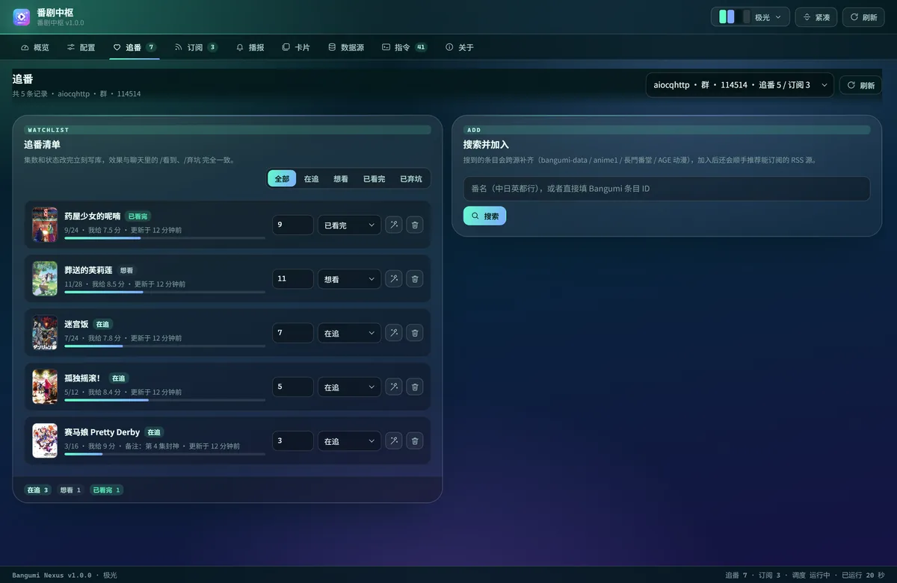

<div align="center">


# 我的番剧 · Bangumi Nexus

在 AstrBot 里查番、记进度、收更新通知。

</div>

## 能做什么

- **查番**：看今日新番、评分、放送时间和观看入口。
- **追番**：按群聊或私聊保存清单，记录看到第几集。
- **收通知**：订阅字幕组 RSS、设置每日播报，或接收下载器的下载完成通知。
- **接入 ani-rss**：同步已有订阅，或用 Webhook 接收更新，不必逐部录入。
- **可视化管理**：在网页上改配置、管理追番和订阅、切换卡片主题；通知可使用 AstrBot 人格转述。

<p align="center">
  
</p>

## 安装

在 AstrBot 管理面板的插件市场搜索 **我的番剧** 并安装。
也可以选择「从链接安装」，填入：

```text
https://github.com/Whereis-Alice/astrbot_plugin_bangumi_nexus
```

如果已经安装了提供同名指令的番剧插件，请先停用，避免重复响应。
环境要求与手动安装见 [安装与配置参考](docs/configuration.md#安装与环境)。

## 先试这几个指令

在 Bot 所在的群聊或私聊里发送：

| 想做什么 | 发送什么 |
| --- | --- |
| 看今天播什么 | `/今日新番` |
| 查一部番 | `/查番 葬送的芙莉莲` |
| 加入追番清单 | `/追番 葬送的芙莉莲` |
| 记下观看进度 | `/看到 葬送的芙莉莲 5` |
| 看追番清单 | `/追番列表` |
| 订阅新集通知 | `/sub 葬送的芙莉莲`，再按提示回复字幕组序号 |
| 查看帮助 | `/番剧中枢` |

`/` 是示例唤醒前缀，请按自己的 AstrBot 设置替换。

**追番清单和更新通知是两件事。** `/追番` 后可按提示选字幕组，也可以另外用 `/sub` 订阅。
新订阅默认不补发历史消息；完整用法见 [RSS 订阅](docs/rss.md)。

## 想让它主动提醒你

- **每天播报新番**：在插件配置中开启「每日播报」、设好时间，再到目标群发送 `/日历订阅 开`。
- **下载完成后通知**：按 [Webhook 接入教程](docs/webhook.md) 配置 ani-rss 或其他下载器。
- **导入 ani-rss 已有的订阅**：按 [订阅同步教程](docs/ani-rss.md) 选择在线同步或离线导入。

只用 Webhook 时，不需要再填 ani-rss 的地址和账号。
通知发到哪里、是否只播追的番、如何使用人格，见 [通知设置](docs/notifications.md)。

## 详细文档

| 我想了解 | 去哪里看 |
| --- | --- |
| 全部指令、别名和权限 | [完整指令](docs/commands.md) |
| 安装要求与每项配置的含义 | [安装与配置参考](docs/configuration.md) |
| 每日播报、通知目标与人格 | [通知设置](docs/notifications.md) |
| 选字幕组、排除词与重复通知 | [RSS 订阅与排除规则](docs/rss.md) |
| 下载器回调与可复制的 Body 模板 | [Webhook 接入](docs/webhook.md) |
| 导入 ani-rss 的追番名单 | [ani-rss 订阅同步](docs/ani-rss.md) |
| 管理面板与卡片主题预览 | [管理面板与主题](docs/appearance.md) |
| 收不到消息、数据不对等问题 | [常见问题与安全](docs/troubleshooting.md) |
| 参与开发与维护 | [开发指南](docs/development.md) |
| 数据来自哪里、借鉴了哪些插件 | [数据源与致谢](docs/credits.md) |

[更新日志](CHANGELOG.md) · [反馈问题](https://github.com/Whereis-Alice/astrbot_plugin_bangumi_nexus/issues) · [AGPL-3.0-or-later 许可证](LICENSE)

本插件提供番剧信息与链接索引，不存储或分发视频。数据与内容权利归各自站点及权利人所有。
