# 管理面板与主题

[← 返回首页](../README.md)

- [卡片主题](#卡片主题)
- [管理面板](#管理面板)
- [面板长什么样](#面板长什么样)
- [6 套主题](#6-套主题)
- [渲染与回退](#渲染与回退)

## 卡片主题

六套配色，聊天里发 `/番剧中枢 樱绯` 就能临时换一套看看，满意了再在配置里定下来。

| 午夜霓虹 `midnight` | 极光 `aurora` |
| --- | --- |
| 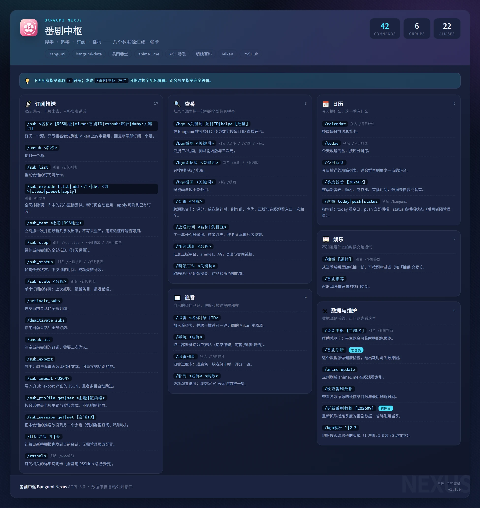 | 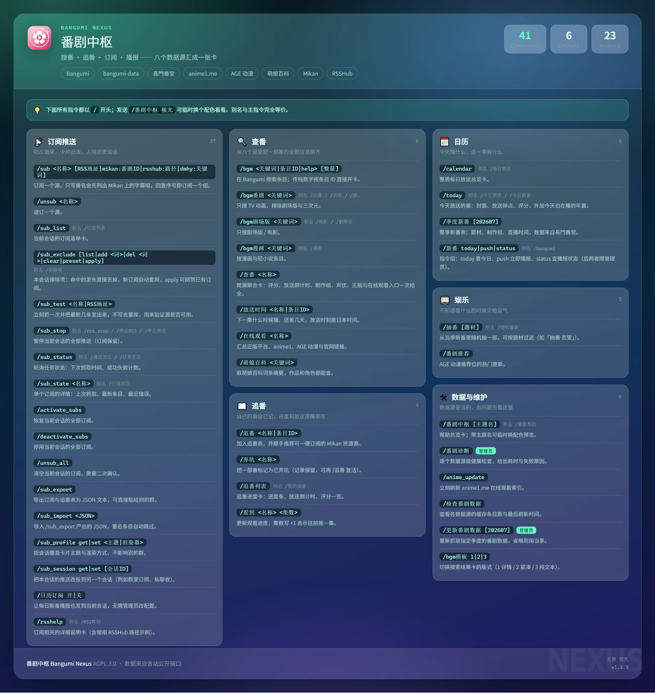 |

| 樱绯 `sakura` | 蓝图 `blueprint` |
| --- | --- |
| 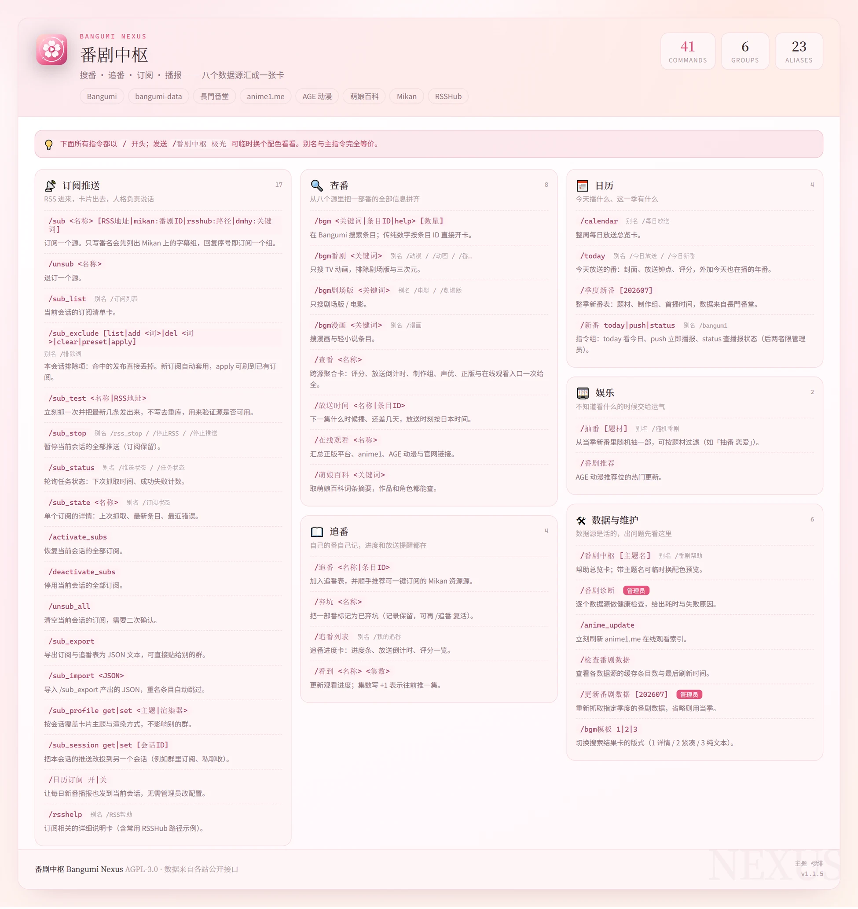 | 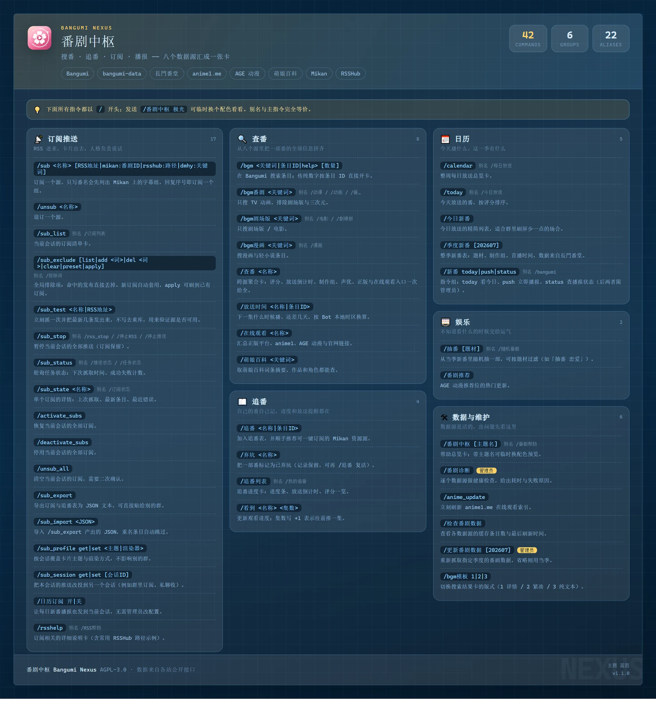 |

| 素笺 `paper` | 落日 `sunset` |
| --- | --- |
| 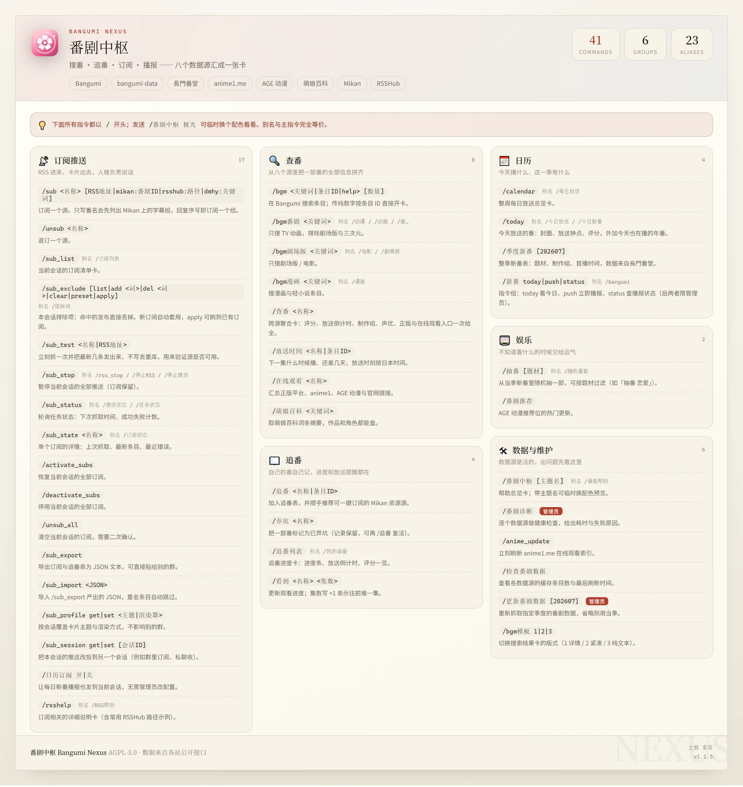 | 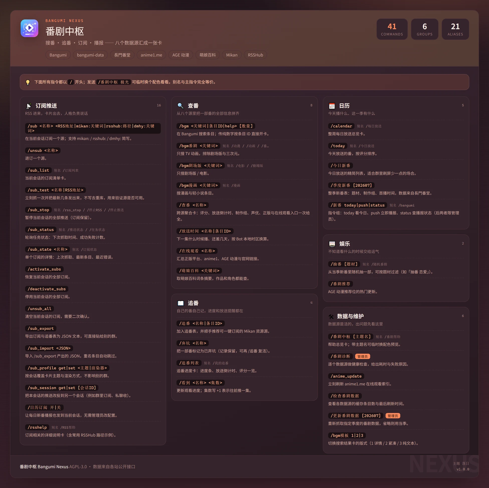 |

> 上面这六张就是 `/番剧中枢` 的帮助卡实拍，其余卡片（日历、条目、追番、更新通知、抽番、季度表、诊断）
> 共用同一套设计语言与配色变量。

## 管理面板

装好插件后，Dashboard 侧边栏会多出一个「我的番剧」页面。10 个视图分工如下：

<p align="center">
  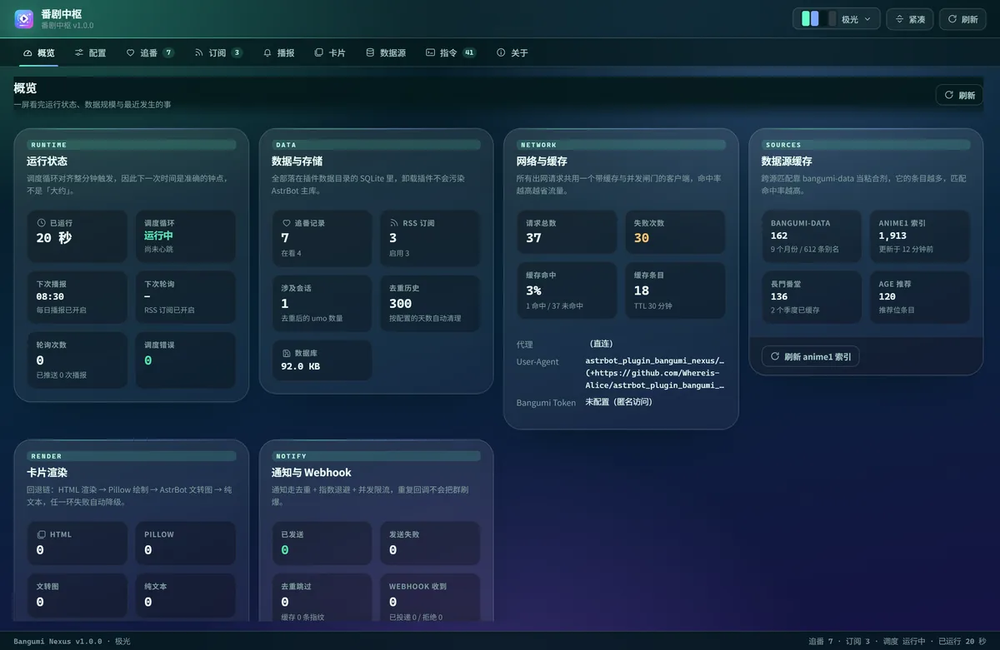
</p>

| 视图 | 你能在这里做什么 |
| --- | --- |
| **概览** | 运行状态一屏看完：数据源统计、HTTP 缓存命中率、调度器下次执行时间、推送成功/失败计数、活动日志（可按级别过滤）；还有「刷新 anime1」「立即播报」「立即抓取 RSS」「Webhook 自测」几个一键操作 |
| **配置** | 配置项按类别编辑，开关/滑块/下拉/多行文本各按类型给控件，带说明与默认值提示。密钥类字段只显示「已配置」不回显 |
| **追番** | 选一个会话，改进度、改状态、打分、写备注、删条目；也能直接在这里搜名字加进追番表 |
| **订阅** | 增删订阅、单条测试抓取、批量启停、导出 JSON / 粘贴导入；还能**只填番名点「列字幕组」**从 Mikan 候选里挑一个订上，以及勾选**本会话排除项**并一键回写到已有订阅 |
| **播报** | 配置推送目标、查看「自助订阅」进来的会话、按指定星期手动触发一次播报 |
| **卡片** | 6 主题 × 4 种卡片的**真实渲染**预览，点开可放大到原始像素、可下载 PNG。改主题前先来这里看长相 |
| **数据源** | 8 个数据源逐个体检，给出耗时与失败原因，一眼看出是哪个站挂了 |
| **指令** | 全部 42 条指令速查表，按分类分组，显示别名与权限要求 |
| **ani-rss 同步** | 填地址与凭据、测连接、指定同步进哪个会话、四个开关与间隔就地改、点一下立刻同步，并列出已认领的条目与上次同步账目；连不上时用**离线导入**粘一份 JSON，效果等同 |
| **关于** | 版本、限额、安全提示、数据源致谢 |

## 面板长什么样

| | |
| :--: | :--: |
| 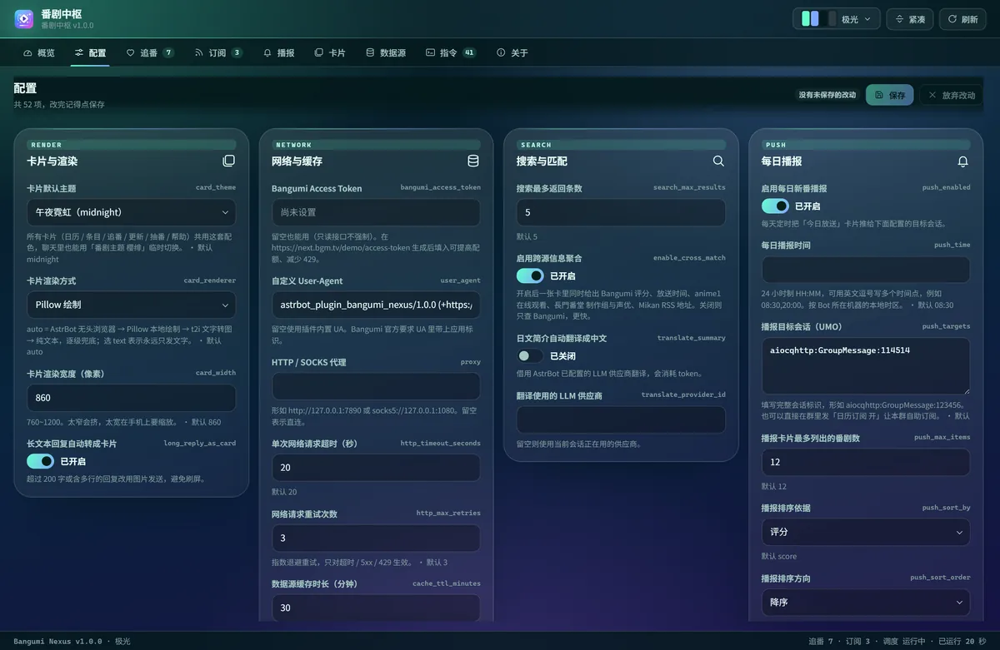 |  |
| **配置** · 配置项按类别分组，控件按类型自动匹配 | **追番** · 进度 / 状态 / 评分 / 备注就地改 |
| 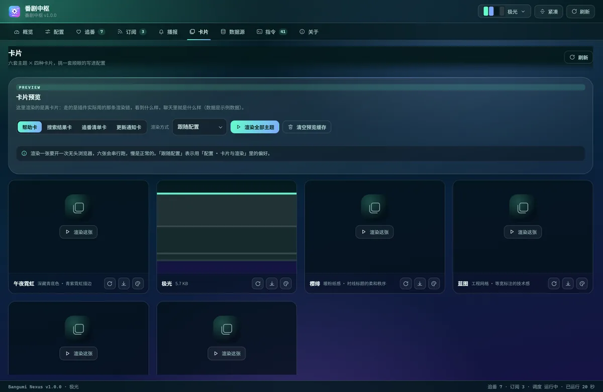 | 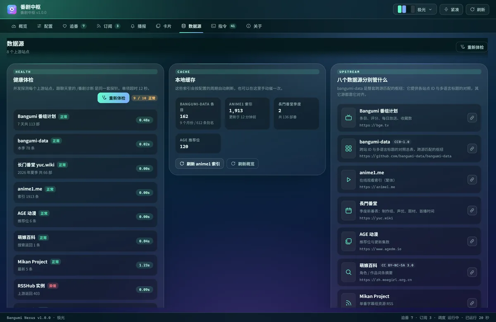 |
| **卡片** · 6 主题 × 4 版式真实渲染预览 | **数据源** · 8 个源逐个体检，给耗时与失败原因 |
| 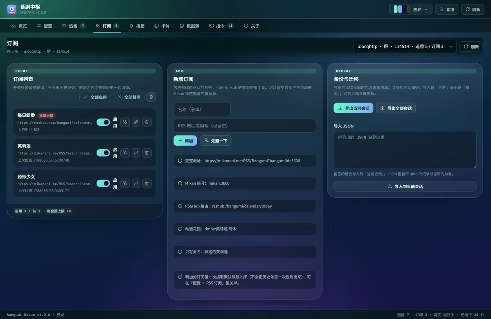 | 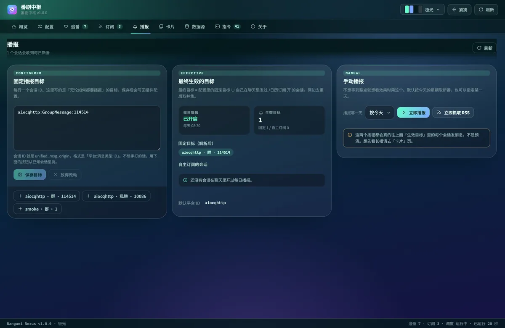 |
| **订阅** · 增删、单条测试、批量启停、导入导出 | **播报** · 推送目标与自助订阅会话管理 |

订阅视图里的两块面板，等价于聊天里的 `/sub` 选源与 `/sub_exclude`，但不用记指令：

- **挑一个字幕组** —— 在「新增订阅」里只填番名、点「列字幕组」，下面会展开 Mikan 上的候选（带最后更新日、语言 / 画质标签、RSS 地址），点「订阅这个」直接落库。
- **排除项** —— 顶上是只读的**全局层**（在配置页设，所有会话都吃），下面 16 个内置预设是一排开关，另有自定义词输入框（逗号 / 空格分隔都认）。底部实时预览两层合并后真正参与过滤的关键词，并显示同集归并当前的开关与优先顺序；「保存改动」只存本会话偏好（影响以后新增的订阅），「回写到已有订阅」才会刷到当前会话已有的订阅上。

指令视图会把 42 条指令按 6 个分类整张摊开，别名和权限都在表里：

<p align="center">
  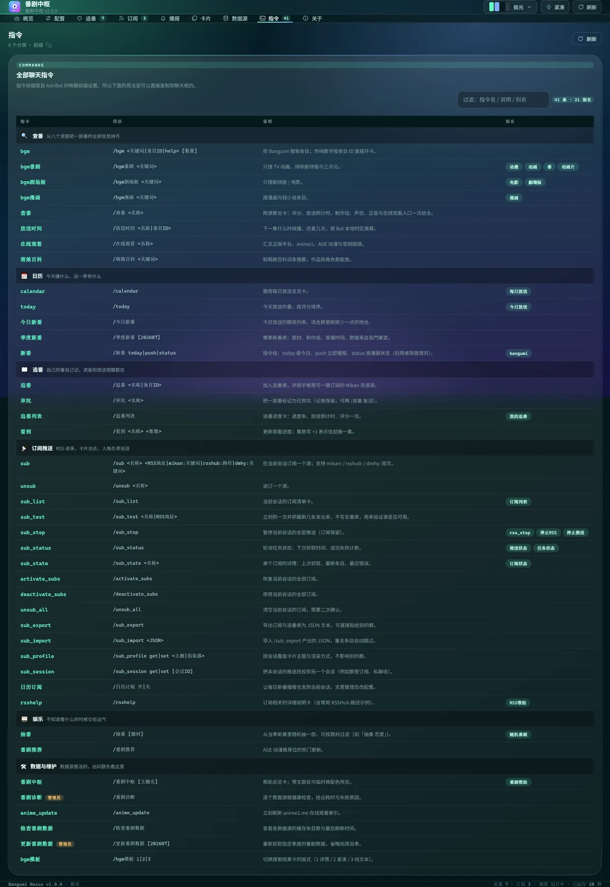
</p>

## 6 套主题

面板本身也有 6 套主题（和卡片同名同配色），右上角随时切换；还有一个紧凑模式，屏幕小的时候能多塞点内容。
**界面偏好存在后端**，所以换浏览器、换设备打开也是你上次的样子。

<p align="center">
  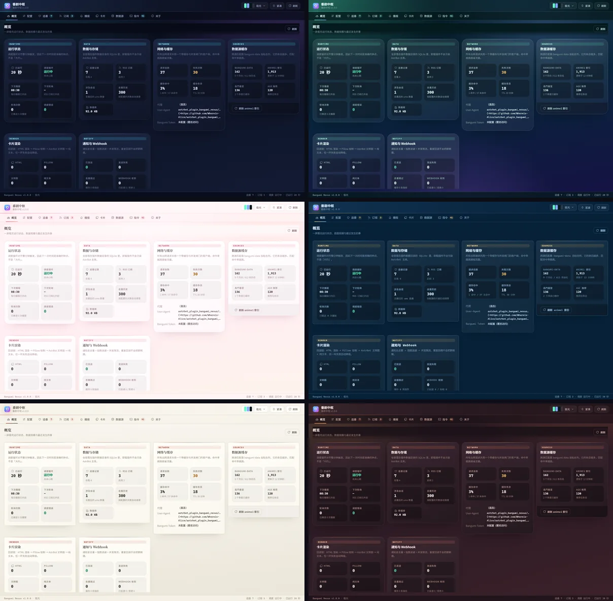
</p>

<p align="center"><sub>从左上到右下：午夜霓虹 · 极光 · 樱绯 · 蓝图 · 素笺 · 落日</sub></p>

窄屏会自动折成单列，手机上也能改配置、点一次播报：

<p align="center">
  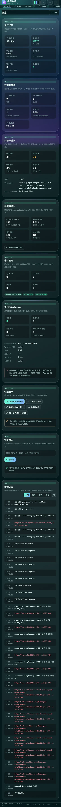
</p>

## 渲染与回退

聊天平台对图片友好，对长文本不友好，所以插件的默认输出是卡片。但渲染是最容易出问题的一环，
因此设计了一条 4 级降级链：

```
html    AstrBot 自带无头浏览器渲染 HTML 模板（最好看，15 套版式）
  ↓ 连续 3 次失败
raster  Pillow 本地绘制（不依赖浏览器，样式简化但信息完整）
  ↓ Pillow 缺失或字体不可用
t2i     AstrBot 的文字转图服务
  ↓ 服务不可用
text    纯文本（永远可用的最后一站）
```

几个实现细节：

- `auto` 模式下，HTML 渲染连续失败 3 次会进入 **120 秒冷却**，期间直接走 Pillow，不再反复撞墙。冷却结束自动恢复。
- 渲染结果按内容哈希缓存在插件数据目录，**最多 240 个文件 / 保留 6 小时**，超出自动清理，不会无限堆盘。
- 番剧封面单独缓存 30 天，单张上限 4 MB。
- 想彻底关掉图片，把 `card_renderer` 设成 `text` 就行，所有功能都会退化成纯文本，不会缺功能。
